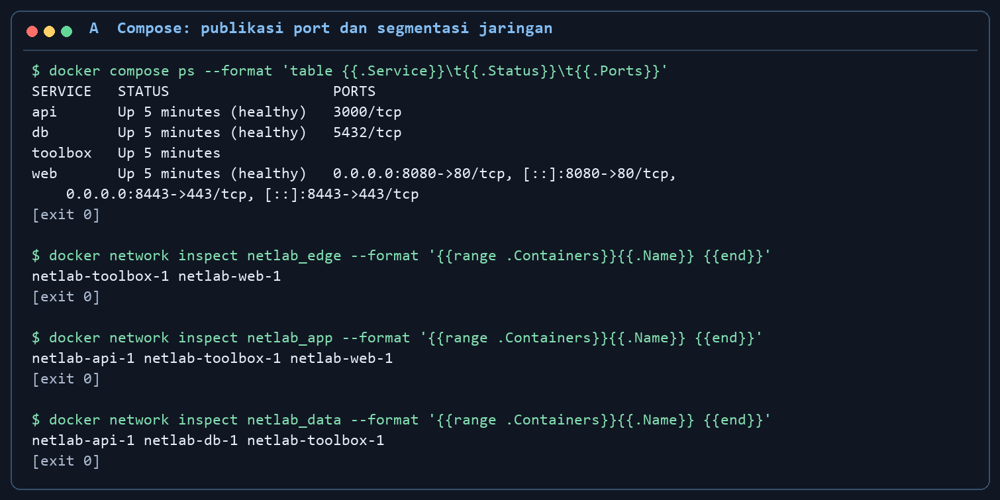
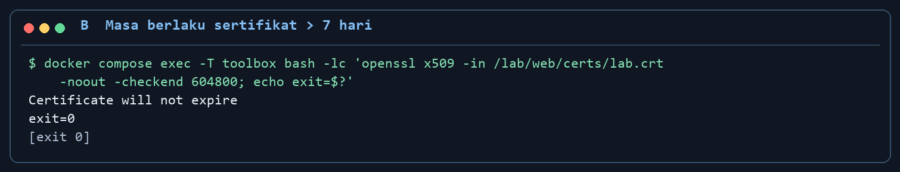
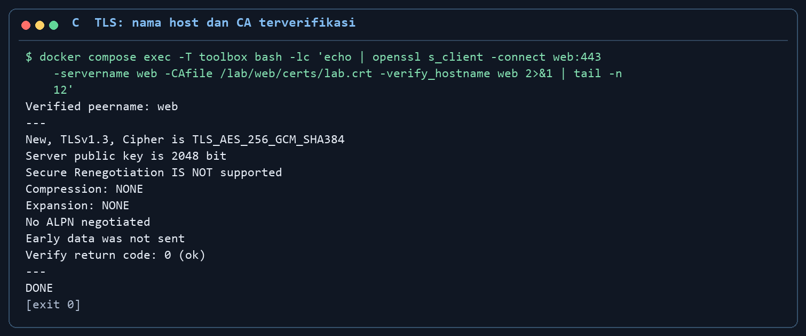
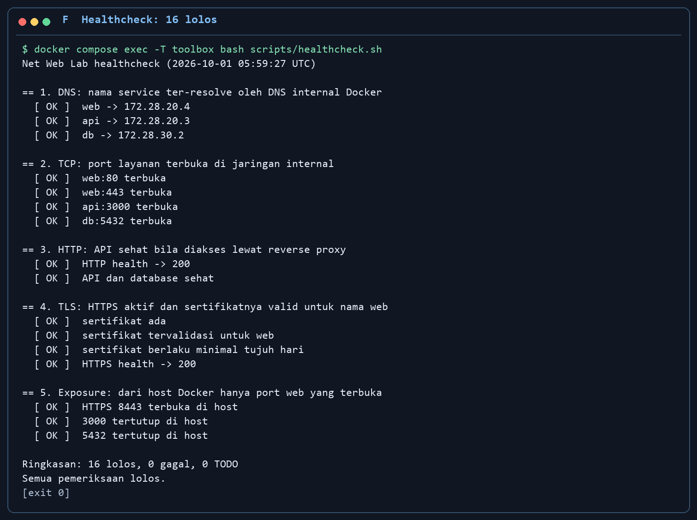
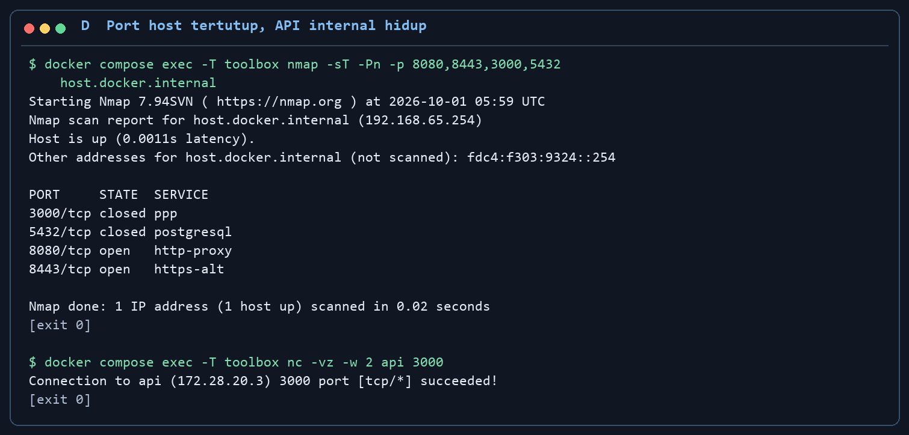
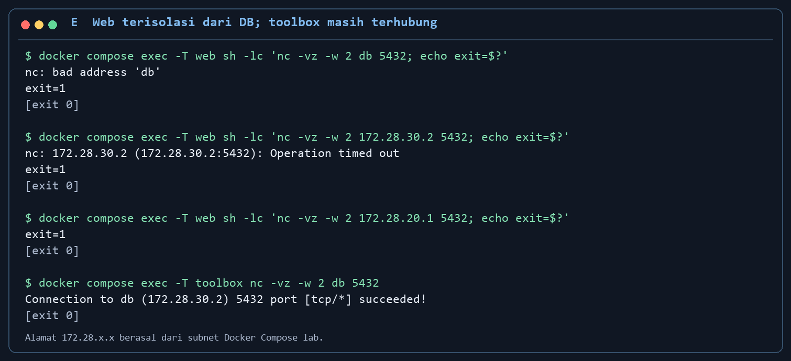
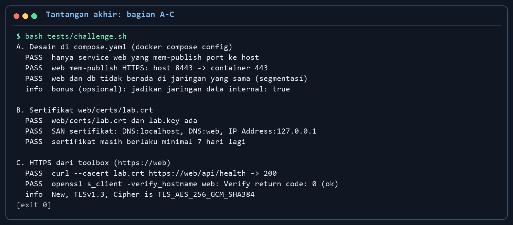

# Kunci jawaban mahasiswa - Lab 03 Networking & Web Services

**COMP6991031 | Referensi penyelesaian challenge A-F.** PDF ini adalah jawaban lengkap untuk [modul mahasiswa Lab 03](MODUL_MAHASISWA.md). Jalankan perintah dari **root repo** tempat `compose.yaml` berada, di terminal Codespaces atau Git Bash pada laptop lokal. Jangan menjalankan `bash tests/challenge.sh` dari dalam `toolbox`: skrip tersebut perlu memanggil Docker Compose pada host. Alat jaringan seperti `dig`, `nmap`, dan `openssl` dijalankan di `toolbox`.

Kunci ini disusun dari solusi yang diuji: **smoke 12 PASS/0 FAIL, healthcheck 16 lolos/0 gagal/0 TODO, challenge 15 PASS/0 FAIL**. Angka IP, nama container, dan waktu pada screenshot bisa berbeda. Cuplikan terminal dari uji lokal ditata agar terbaca; jalankan perintah sendiri untuk menghasilkan bukti praktik pribadi.

## 1. Pahami keadaan awal

Jalankan starter lebih dahulu. Di Codespaces, gunakan terminal pada root repo; pada laptop lokal, buka Docker Desktop dan Git Bash di root repo:

```bash
docker compose config -q
docker compose up -d --build --wait
docker compose ps
bash tests/smoke.sh
bash tests/challenge.sh
```

Smoke yang benar memberi **12 PASS, 0 FAIL**. Pada starter, challenge memang belum lulus; contoh uji memberi **1 PASS, 11 FAIL**. Daftar FAIL A-F adalah daftar tugas, bukan error platform. Port awal 8080/3000/5432 masih dipublish ke host.


*Langkah: jalankan `bash tests/challenge.sh` dari root repo. Fungsi: melihat tugas A-F sebelum perubahan. Cara kerja: tes membaca Compose dan mencoba sertifikat, HTTPS, port, segmentasi, serta healthcheck. Baca hasil: FAIL awal dan hint menunjukkan pekerjaan berikutnya; jumlah awal dapat berubah sesuai keadaan mesin.*

## 2. Jawaban A, D, dan E - desain Compose dan segmentasi

Edit **`compose.yaml`**. Pada service `web`, pertahankan mapping HTTP dan tambahkan HTTPS dengan indentasi yang sama:

```yaml
    ports:
      - "8080:80"
      - "8443:443"
```

Pada service `api`, hapus **seluruh blok** berikut, termasuk baris `ports:`:

```yaml
    ports:
      - "3000:3000"
```

Pada service `db`, hapus **seluruh blok** berikut:

```yaml
    ports:
      - "5432:5432"
```

Pertahankan `web` pada jaringan `edge` dan `app`; `api` pada `app` dan `data`; `db` hanya pada `data`; `toolbox` pada ketiganya. **Jangan hapus** `build`, `image`, `environment`, `volumes`, `depends_on`, atau `healthcheck`. Menghapus `ports:` dari API/DB hanya menutup akses **dari host**, bukan koneksi internal API ke DB. Web tidak perlu jaringan langsung ke DB.

Simpan file, lalu validasi hasil Compose yang benar-benar dibaca Docker:

```bash
docker compose config -q
git diff -- compose.yaml
```

`config -q` diam berarti YAML valid. `git diff` memastikan edit telah tersimpan. Pada laptop lokal, VS Code Desktop atau Notepad dapat mengedit file; pada Codespaces gunakan editor di area atas, bukan panel Ports. Bila prompt Bash berubah menjadi `>`, tekan **Ctrl+C** karena shell sedang menunggu penutup kutip/perintah lanjutan.



*Langkah: setelah recreate, jalankan `docker compose ps` dan `docker network inspect netlab_edge`, `netlab_app`, `netlab_data`. Fungsi: memeriksa port host serta keanggotaan jaringan. Cara kerja: Docker membaca konfigurasi dan metadata container aktif. Baca hasil: hanya web mem-publish host; edge memuat web/toolbox, app memuat web/api/toolbox, data memuat api/db/toolbox, tanpa web. Ini cuplikan output uji lokal yang ditata agar terbaca.*

## 3. Jawaban B - sertifikat yang benar

Buat sertifikat **sebelum** mengaktifkan konfigurasi HTTPS nginx. Starter perlu masih berjalan agar perintah `exec toolbox` dapat dipakai:

```bash
docker compose exec toolbox bash scripts/make-cert.sh
docker compose exec toolbox openssl x509 -in /lab/web/certs/lab.crt -noout -subject -dates
docker compose exec toolbox openssl x509 -in /lab/web/certs/lab.crt -noout -ext subjectAltName
docker compose exec toolbox openssl x509 -in /lab/web/certs/lab.crt -noout -checkend 604800
```

Skrip membuat `web/certs/lab.crt` dan `lab.key`. `lab.crt` adalah sertifikat publik; `lab.key` adalah **private key** dan sudah masuk `.gitignore`. Periksa SAN berisi `DNS:localhost`, `DNS:web`, dan `IP Address:127.0.0.1`. `checkend 604800` memberi exit 0 bila sertifikat masih berlaku setidaknya tujuh hari. Perintah melalui toolbox bekerja juga pada laptop yang tidak memasang OpenSSL di host.


*Langkah: jalankan `openssl x509` dari toolbox dengan `-subject -dates -ext subjectAltName`. Fungsi: memeriksa identitas dan umur sertifikat. Cara kerja: OpenSSL membaca CRT publik tanpa membuka private key. Baca hasil: SAN localhost/web/127.0.0.1 dan `notAfter` di masa depan. Ini cuplikan output uji lokal yang ditata agar terbaca.*



*Langkah: jalankan `openssl x509 -in /lab/web/certs/lab.crt -noout -checkend 604800`. Fungsi: menolak sertifikat yang segera kedaluwarsa. Cara kerja: OpenSSL menghitung sisa masa berlaku dalam detik. Baca hasil: `Certificate will not expire` dan exit 0. Ini cuplikan output uji lokal yang ditata agar terbaca.*

## 4. Jawaban C - aktifkan HTTPS nginx

Template nginx sudah berisi listener TLS port 443, path sertifikat, serta reverse proxy `/api/`. Nginx hanya memuat file berakhiran `.conf`, jadi aktifkan dengan menyalin template:

```bash
cp web/nginx/https.conf.example web/nginx/https.conf
docker compose up -d --force-recreate --wait
docker compose ps
docker compose exec toolbox curl -i --cacert /lab/web/certs/lab.crt https://web/api/health
```

`--force-recreate` menerapkan port/jaringan baru pada container. Respons curl harus **HTTP 200** dengan `status: ok` dan `db: up`. Opsi `--cacert` memeriksa sertifikat self-signed lab dan nama `web`; jangan mengganti bukti ini dengan `curl -k`.

Verifikasi handshake TLS dan hostname secara terpisah:

```bash
docker compose exec toolbox bash
CA=/lab/web/certs/lab.crt
echo | openssl s_client -connect web:443 -servername web -CAfile "$CA" -verify_hostname web
exit
```

Cari `Verify return code: 0 (ok)`. Di laptop, buka `https://localhost:8443`; di Codespaces buka port 8443 dari panel Ports setelah nginx aktif. Browser mungkin memperingatkan sertifikat self-signed. URL forwarding Codespaces yang memakai HTTPS pada port **8080** saja **belum** membuktikan nginx melakukan TLS; bukti teknisnya adalah request `https://web` dengan `--cacert` dan OpenSSL.


*Langkah: dari toolbox jalankan `curl -i --cacert /lab/web/certs/lab.crt https://web/api/health`. Fungsi: menguji TLS sekaligus jalur nginx -> API -> DB. Cara kerja: curl memverifikasi sertifikat, lalu nginx meneruskan GET ke API. Baca hasil: HTTP 200, `status: ok`, dan `db: up`. Ini cuplikan output uji lokal yang ditata agar terbaca.*



*Langkah: jalankan `openssl s_client` dengan `-servername web`, `-CAfile`, dan `-verify_hostname web`. Fungsi: memeriksa handshake serta identitas server. Cara kerja: OpenSSL mengecek CA lab dan SAN untuk nama web. Baca hasil: protokol TLS aktif dan `Verify return code: 0 (ok)`. Ini cuplikan output uji lokal yang ditata agar terbaca.*

## 5. Jawaban F - lima fungsi `healthcheck.sh`

Buka `scripts/healthcheck.sh`. **Pertahankan** konfigurasi di atas, helper `ok`, `bad`, `todo`, `section`, `port_open`, serta `main` di bawah. Ganti hanya isi **lima fungsi** berikut. Hapus pemanggilan `todo` di tiap fungsi; pemeriksaan harus benar-benar menggunakan alat jaringan. Jumlah hasil referensi: 3 DNS + 4 TCP + 2 HTTP + 4 TLS + 3 exposure = **16 lolos**.

### `check_dns` - 3 pemeriksaan

```bash
check_dns() {
  section "1. DNS: nama service ter-resolve oleh DNS internal Docker"
  for name in "$WEB" "$API" "$DB"; do
    ip="$(dig +short "$name" A | head -n 1)"
    if [ -n "$ip" ]; then ok "$name -> $ip"; else bad "$name tidak ter-resolve"; fi
  done
}
```

`dig` bertanya kepada DNS internal Docker dari toolbox. IP yang diperoleh bersifat dinamis; nama service yang digunakan aplikasi tetap stabil.

### `check_tcp` - 4 pemeriksaan

```bash
check_tcp() {
  section "2. TCP: port layanan terbuka di jaringan internal"
  for target in "$WEB:80" "$WEB:443" "$API:3000" "$DB:5432"; do
    name="$(printf '%s' "$target" | cut -d: -f1)"
    port="$(printf '%s' "$target" | cut -d: -f2)"
    if port_open "$name" "$port"; then ok "$target terbuka"; else bad "$target tertutup"; fi
  done
}
```

`port_open` memakai netcat untuk mencoba TCP dari toolbox. Port 3000/5432 tetap harus terbuka **secara internal**, walaupun tidak dipublish ke host.

### `check_http` - 2 pemeriksaan

```bash
check_http() {
  section "3. HTTP: API sehat bila diakses lewat reverse proxy"
  body="$(mktemp)"
  code="$(curl -s -o "$body" -w '%{http_code}' --max-time "$TIMEOUT" "http://$WEB/api/health")"
  if [ "$code" = 200 ]; then ok "HTTP health -> 200"; else bad "HTTP health -> $code"; fi
  if jq -e '.status == "ok" and .db == "up"' "$body" >/dev/null 2>&1; then
    ok "API dan database sehat"
  else
    bad "JSON health tidak menunjukkan status ok dan db up"
  fi
  rm -f "$body"
}
```

Status 200 membuktikan endpoint menjawab; `jq` memeriksa bahwa body juga menunjukkan database hidup. Keduanya diperlukan agar hasil tidak sekadar HTTP 200 kosong.

### `check_tls` - 4 pemeriksaan

```bash
check_tls() {
  section "4. TLS: HTTPS aktif dan sertifikatnya valid untuk nama $WEB"
  if [ -s "$CA" ]; then ok "sertifikat ada"; else bad "sertifikat tidak ada"; return; fi
  if openssl s_client -connect "$WEB:443" -servername "$WEB" -CAfile "$CA" \
      -verify_hostname "$WEB" </dev/null 2>/dev/null | grep -q 'Verify return code: 0 (ok)'; then
    ok "sertifikat tervalidasi untuk $WEB"
  else
    bad "sertifikat TLS gagal diverifikasi"
  fi
  if openssl x509 -in "$CA" -noout -checkend 604800 >/dev/null 2>&1; then
    ok "sertifikat berlaku minimal tujuh hari"
  else
    bad "sertifikat segera kedaluwarsa"
  fi
  code="$(curl -s -o /dev/null -w '%{http_code}' \
    --max-time "$TIMEOUT" --cacert "$CA" "https://$WEB/api/health")"
  if [ "$code" = 200 ]; then ok "HTTPS health -> 200"; else bad "HTTPS health -> $code"; fi
}
```

Empat cek membuktikan keberadaan CRT, identitas web, masa berlaku minimal tujuh hari, serta health melalui HTTPS dengan CA lab. `-servername` mengirim SNI; `-verify_hostname` memeriksa SAN web.

### `check_exposure` - 3 pemeriksaan

```bash
check_exposure() {
  section "5. Exposure: dari host Docker hanya port web yang terbuka"
  if port_open "$OUTSIDE" "$HTTPS_PORT"; then
    ok "HTTPS $HTTPS_PORT terbuka di host"
  else
    bad "HTTPS $HTTPS_PORT tertutup di host"
  fi
  for port in 3000 5432; do
    if port_open "$OUTSIDE" "$port"; then
      bad "$port terbuka di host"
    else
      ok "$port tertutup di host"
    fi
  done
}
```

`OUTSIDE` bernilai `host.docker.internal`, yaitu host Docker sebagaimana dilihat dari toolbox. Di host, 8443 harus menerima koneksi, sedangkan 3000/5432 harus tertutup. Ini berbeda dari empat cek TCP internal sebelumnya.

Validasi sintaks dan jalankan di **toolbox**:

```bash
bash -n scripts/healthcheck.sh
docker compose exec -T toolbox bash scripts/healthcheck.sh
```

Baris akhir harus `Ringkasan: 16 lolos, 0 gagal, 0 TODO` dan `Semua pemeriksaan lolos`. Jangan ubah format `Ringkasan:` karena challenge membacanya. Jika skrip dijalankan langsung di host, ia memang menolak; jalankan melalui `docker compose exec`.



*Langkah: jalankan `docker compose exec -T toolbox bash scripts/healthcheck.sh`. Fungsi: menguji DNS, TCP, HTTP, TLS, dan exposure dari lokasi yang benar. Cara kerja: lima fungsi memanggil alat jaringan dan helper `ok`/`bad` menghitung hasil nyata. Baca hasil: 16 lolos, 0 gagal, 0 TODO, exit 0. Ini cuplikan output uji lokal yang ditata agar terbaca.*

## 6. Uji akhir A-F, browser, dan Git

Setelah semua file tersimpan, ulangi pemeriksaan dari root repo:

```bash
docker compose config -q
docker compose up -d --force-recreate --wait
docker compose ps
docker compose exec -T toolbox bash scripts/healthcheck.sh
bash tests/smoke.sh
bash tests/challenge.sh
```

Target referensi: **12 PASS/0 FAIL** pada smoke; **16 lolos/0 gagal/0 TODO** pada healthcheck; **15 PASS/0 FAIL** pada challenge. `docker compose ps` hanya mem-publish 8080/8443 pada web. API dan DB masih dapat menampilkan angka port internal 3000/5432, tetapi tidak boleh ada panah host `3000->3000` atau `5432->5432`.



*Langkah: dari toolbox jalankan `nmap -sT -Pn -p 8080,8443,3000,5432 host.docker.internal`, lalu `nc -vz api 3000`. Fungsi: membandingkan exposure host dengan koneksi internal. Cara kerja: nmap mencoba socket pada host Docker; netcat mencoba API di jaringan app. Baca hasil: 8080/8443 open, 3000/5432 closed di host, tetapi API internal succeeded. Ini cuplikan output uji lokal yang ditata agar terbaca.*



*Langkah: bandingkan percobaan `nc -vz -w 2` dari web ke DB melalui nama/IP/gateway dengan percobaan dari toolbox. Fungsi: membuktikan segmentasi tanpa mematikan database. Cara kerja: netcat mencoba handshake TCP dari container yang berbeda. Baca hasil: `exit=1` di dalam shell web berarti akses gagal, sedangkan toolbox ke DB succeeded; label `[exit 0]` luar hanyalah proses pembungkus. Ini cuplikan output uji lokal yang ditata agar terbaca.*



*Langkah: jalankan `bash tests/challenge.sh`. Fungsi: menilai Compose, sertifikat, dan HTTPS. Cara kerja: bagian A membaca desain, B membaca CRT/SAN/masa berlaku, C meminta health lewat TLS dengan verifikasi nama. Baca hasil: A 3 PASS, B 3 PASS, C 2 PASS pada contoh uji. Ini cuplikan output uji lokal yang ditata agar terbaca.*


*Langkah: baca lanjutan output `bash tests/challenge.sh` yang sama. Fungsi: menilai port host, isolasi web dari DB, serta healthcheck. Cara kerja: D mencoba koneksi dari host/toolbox, E menguji jalur web ke DB, F menjalankan healthcheck. Baca hasil: D 5 PASS, E 1 PASS, F 1 PASS; ringkasan `challenge: 15 PASS, 0 FAIL`. Ini cuplikan output uji lokal yang ditata agar terbaca.*

Buka web pada `https://localhost:8443` (laptop) atau port 8443 pada Codespaces, lalu isi form **Tulis catatan**. Respons **201 Created** dan catatan baru membuktikan jalur tulis browser -> nginx -> API -> PostgreSQL tetap bekerja setelah TLS/segmentasi. Browser mungkin menampilkan peringatan self-signed; gunakan uji `curl --cacert` dan OpenSSL di atas sebagai bukti sertifikat tervalidasi.


*Langkah: isi form **Tulis catatan**, klik **Simpan catatan**, dan amati hasil. Fungsi: menguji alur tulis aplikasi tiga tier setelah perubahan jaringan. Cara kerja: browser POST ke nginx, diteruskan ke API, lalu API menyimpan ke PostgreSQL. Baca hasil: `201 Created` dan catatan baru tampil. Ini cuplikan uji lokal; ambil screenshot hasil sendiri.*

Sebelum commit/push, isi `student.json` dan laporan, lalu pastikan private key tidak ikut Git:

```bash
git status --short
git check-ignore web/certs/lab.key
git add compose.yaml web/nginx/https.conf scripts/healthcheck.sh student.json hasil
git diff --cached --check
git diff --cached --name-only
git commit -m "lab03: HTTPS dan segmentasi selesai"
git push
```

`git check-ignore` harus menampilkan `web/certs/lab.key`. Jangan commit kunci privat, `.env`, token, atau data pribadi. CI `stack` dan `challenge` akan berjalan setelah push; `student` memerlukan `student.json` terisi. Saat selesai, `docker compose down` menghentikan container tanpa menghapus volume database.


*Perintah: `git status --short` dan `git check-ignore web/certs/lab.key`. Status menunjukkan pekerjaan yang akan di-commit; output `lab.key` dari `check-ignore` membuktikan private key tidak ikut. Kartu ini adalah keluaran uji yang ditata ulang, sehingga file berubah pada repo Anda bisa berbeda.*


*Langkah UI: buka repo GitHub milik Anda sesudah `git push`, lalu lihat branch `main`, commit terbaru, dan berkas solusi. Gambar menampilkan template dosen sebagai petunjuk lokasi; pesan commit dan hasil Actions di repo mahasiswa harus mengikuti pekerjaan mahasiswa sendiri.*


*Perintah: `docker compose down` lalu `docker compose ps`. Docker menghapus container dan network milik lab, daftar `ps` menjadi kosong, sedangkan volume tetap ada karena perintah tidak memakai `-v`. Kartu adalah keluaran perintah aktual yang ditata ulang.*

## Jika hasil belum sesuai

| Gejala | Perbaikan yang diperiksa |
|---|---|
| A gagal | `docker compose config -q`, `docker compose ps`; pastikan hanya web punya `ports:` dan web tidak berbagi jaringan dengan DB. |
| B gagal | Buat ulang sertifikat dengan `docker compose exec toolbox bash scripts/make-cert.sh`; cek SAN dan tanggal. |
| C gagal | Pastikan `https.conf` aktif, CRT/key ada, lalu lihat `docker compose logs web` dan `docker compose exec web nginx -t`. |
| D gagal | Hapus seluruh blok `ports:` API/DB; pastikan aplikasi lain di host tidak memakai 3000/5432. |
| E gagal | Periksa `db` hanya di `data` dan tidak dipublish ke host; recreate container setelah mengubah jaringan. |
| F gagal | Jalankan healthcheck di toolbox; cari `[TODO]`/`[GAGAL]` dan pertahankan format `Ringkasan:`. |

Ulangi `bash tests/smoke.sh` setelah setiap perubahan besar agar API dan database tetap berfungsi. Satu PASS pada challenge awal tidak berarti solusi akhir benar; nilai akhir yang dituju adalah **15 PASS, 0 FAIL**.
