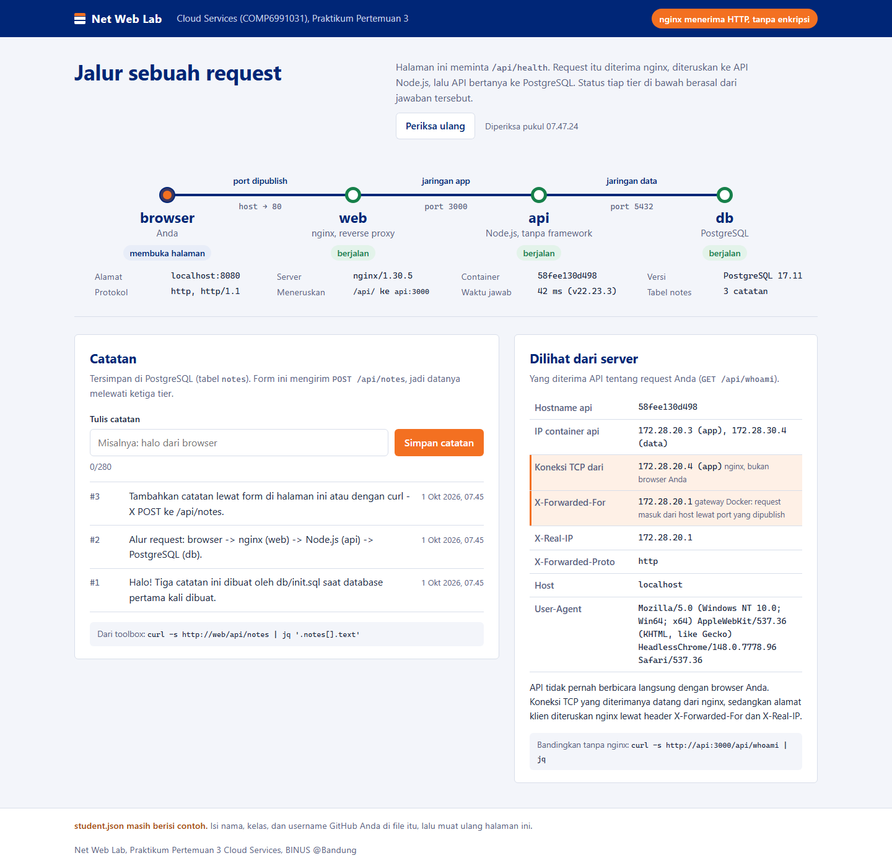
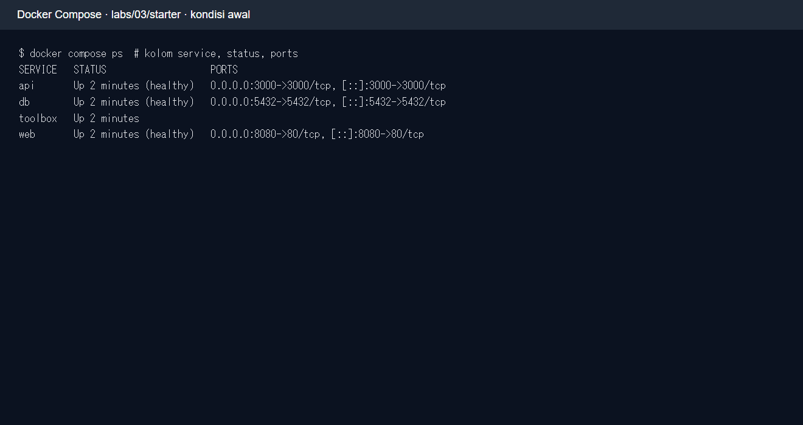
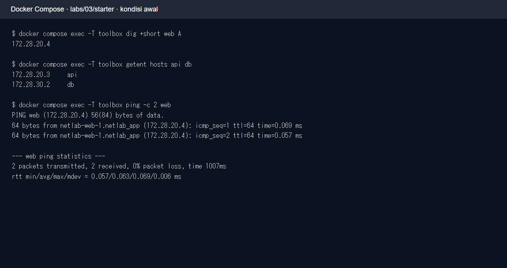
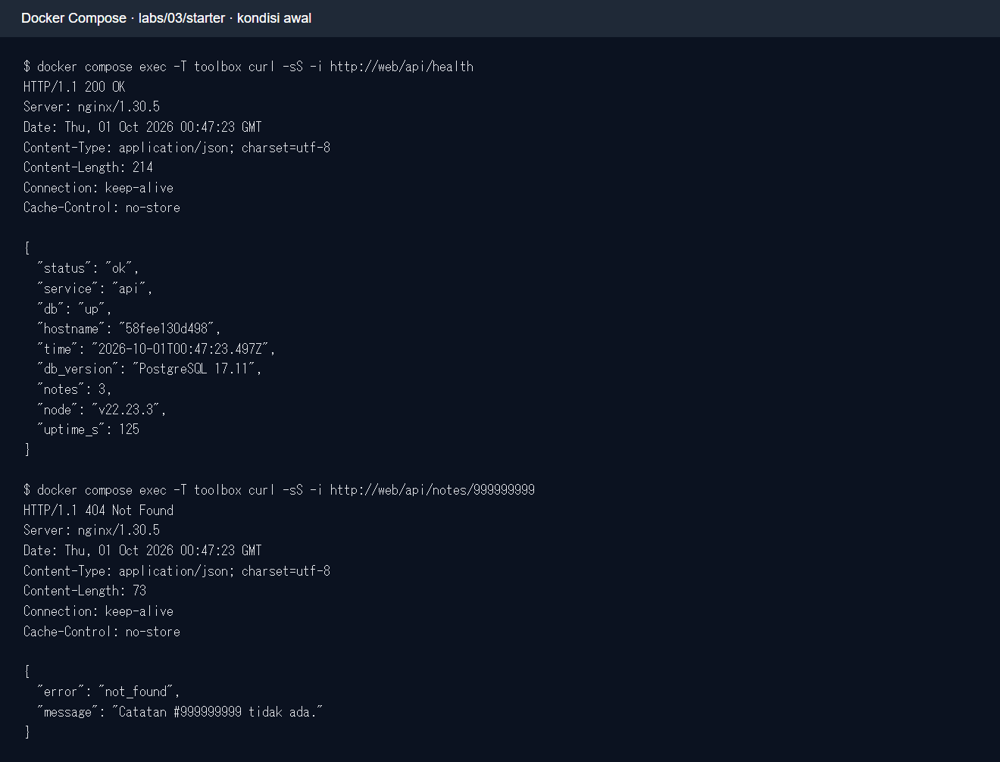
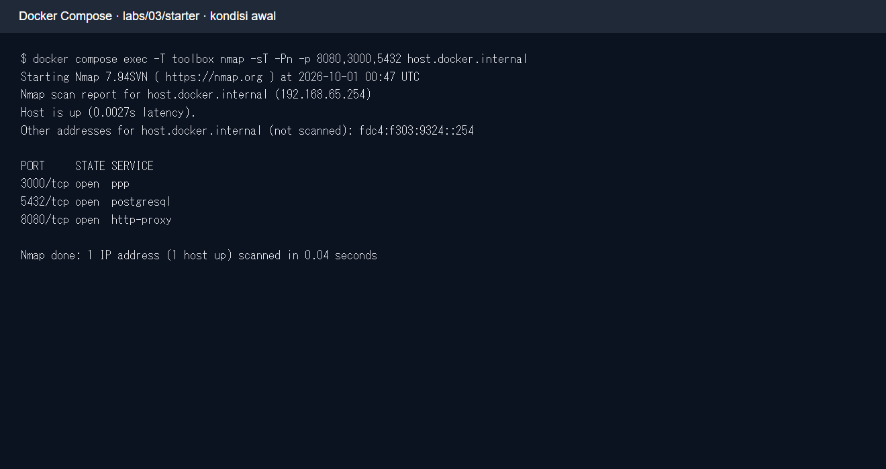
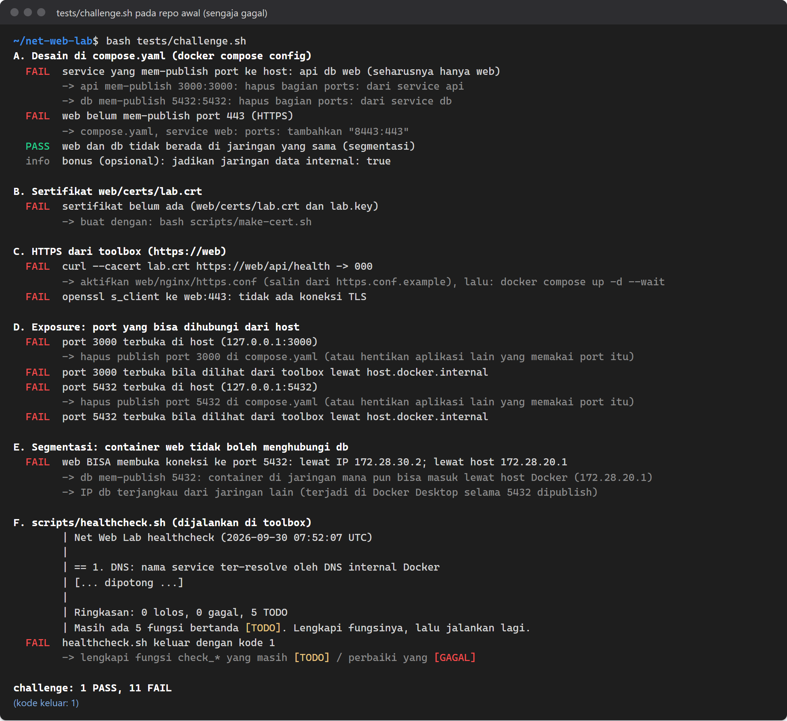
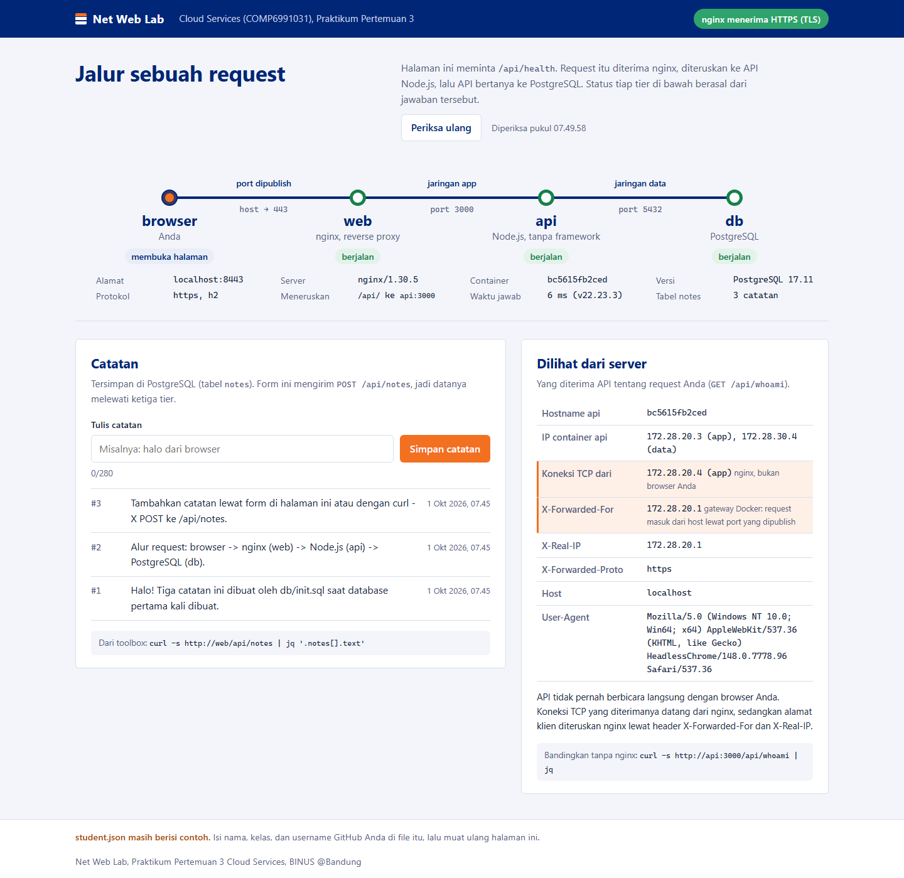
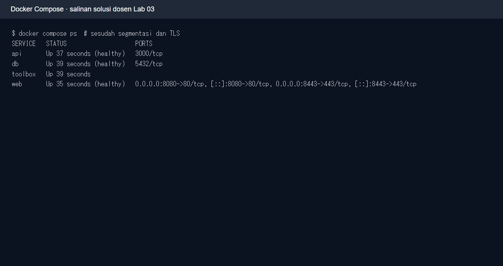

# Modul mahasiswa — Lab 03: DNS, HTTP, TLS, dan segmentasi jaringan

**COMP6991031 · sesi 3.** Repo ini berisi nginx (`web`), API Node.js (`api`), PostgreSQL (`db`), serta `toolbox` dengan alat jaringan. Bacalah juga [README lab](README.md) dan [panduan Git](PANDUAN_GIT.md). Akses dan pemindaian dalam modul ini **hanya untuk service lab milik Anda**.

## Tujuan dan teori ringkas

Anda akan menelusuri satu request melalui DNS → IP/port/TCP → HTTP → reverse proxy nginx → API → database; membedakan jaringan `edge`, `app`, `data`; membaca status/header HTTP; memeriksa sertifikat TLS; dan mengurangi port yang terpapar dari host. Docker Compose menyiapkan target latihan, sedangkan detail container diperdalam pada Lab 04–06. `localhost` di laptop berarti laptop, tetapi `localhost` di `toolbox` berarti container toolbox.

## Prasyarat

- Docker Desktop/Engine dengan Compose plugin aktif dan ruang disk untuk image. Di Windows, jalankan skrip `bash` dari Git Bash atau WSL; `docker compose` harus tersambung ke Engine.
- Jalur utama kelas: GitHub Codespaces dari repo pribadi hasil template dosen. Folder `.devcontainer/` sudah berada di root repo. Jalur lokal memakai Docker Desktop/Engine.
- Hentikan server Lab 01 terlebih dahulu: starter ini memakai host port **3000**; ia juga memakai **8080** dan **5432**. Jika port bentrok, periksa service yang sedang aktif.
- `student.json` di root repo masih contoh. Isi nama, kelas, dan username GitHub tanpa NIM sebelum mengumpulkan.

## 1. Preflight dan hidupkan empat service

Dari root repo, gunakan terminal Codespaces atau Bash/Git Bash:

```bash
docker compose version
docker compose config -q
docker compose up -d --build --wait
docker compose ps
bash tests/smoke.sh
bash tests/test_student.sh
```

`test_student.sh` akan merah jika `student.json` masih contoh. Isi file tersebut lalu ulangi tes. Buka `http://localhost:8080`; pada Codespaces gunakan port 8080 di panel **Ports**. Gambar berikut diambil dari starter yang dijalankan lokal; alamat container dan waktu pada layar Anda akan berbeda.



**Checkpoint 1:** `web`, `api`, `db` sehat; `toolbox` berjalan; `smoke.sh` berakhir **12 PASS, 0 FAIL** pada paket yang diuji. Halaman menggambar alur browser → web → api → db. Catat kolom `PORTS` dari `docker compose ps`.



*Pada tampilan awal, `web` sehat di host 8080; `api` dan `db` juga mem-publish port 3000 dan 5432. Kolom pada gambar diringkas agar mudah dibaca; jalankan `docker compose ps` untuk melihat seluruh kolom di komputer Anda.*

## 2. Periksa DNS dan konektivitas dari toolbox

Masuk ke toolbox:

```bash
docker compose exec toolbox bash
dig web A
nslookup api
getent hosts db
ping -c 3 web
traceroute -m 5 web
```

**Checkpoint 2:** nama service menghasilkan IP internal Docker (umumnya `172.28.x.x`). Amati bahwa `web` dan `api` dapat memiliki lebih dari satu alamat karena terhubung ke beberapa jaringan. Jika ICMP dibatasi lingkungan, catat pembatasannya dan lanjutkan pemeriksaan TCP/HTTP.



*Bandingkan IP untuk `web`, `api`, dan `db`; IP tersebut milik jaringan container dan dapat berbeda saat stack dibuat ulang.*

## 3. Baca request dan status HTTP

Masih **di dalam toolbox**:

```bash
curl -i http://web/
curl -i http://web/api/health
curl -i http://web/api/whoami
curl -i http://web/api/notes/999999999
curl -i -X POST http://web/api/notes -H 'Content-Type: application/json' -d '{"text":"catatan lab 03"}'
wget -qO- http://web/api/health
```

**Checkpoint 3:** halaman dan health memberi 200, catatan tidak ada memberi 404, dan POST valid memberi 201 serta header `Location`. Bandingkan body keluaran `wget` dengan header+body dari `curl -i`.



*Cari baris status pertama pada tiap respons dan perhatikan JSON `db: up` untuk health. Lakukan POST sendiri untuk membuktikan status 201.*

Keluar dari toolbox dengan `exit`, lalu dari host jalankan `curl http://localhost:8080/api/whoami` dan `curl http://localhost:3000/api/whoami`. Di PowerShell gunakan `curl.exe`:

```powershell
curl.exe -i http://localhost:8080/api/whoami
curl.exe -i http://localhost:3000/api/whoami
```

Bandingkan field `viaProxy` dan header penerusan dari nginx. Port host 3000 yang dapat diakses langsung adalah temuan awal, bukan keadaan akhir yang diinginkan.

## 4. Periksa port dan tantangan awal

Masuk lagi ke toolbox (`docker compose exec toolbox bash`) dan pindai **target lokal lab**:

```bash
nmap -sT -Pn -p 80,3000,5432 web
nmap -sT -Pn -p 3000 api
nmap -sT -Pn -p 8080,3000,5432 host.docker.internal
nc -vz -w 2 web 80
nc -vz -w 2 api 3000
nc -vz -w 2 host.docker.internal 5432
exit
bash tests/challenge.sh
```

**Checkpoint 4:** pada starter, `challenge.sh` **sengaja gagal**. Uji paket menunjukkan **1 PASS, 11 FAIL**: API/DB masih mem-publish port, HTTPS belum aktif, dan `healthcheck.sh` masih TODO. Angka IP dan durasi bisa berbeda.



*Sebelum memperbaiki Compose, cocokkan hasil `nmap` dengan kolom `PORTS` pada gambar di langkah 1. Pindai hanya stack latihan milik Anda.*

Gambar berikut berasal dari materi sumber dan menunjukkan kegagalan awal yang memang perlu diselesaikan mahasiswa.



## 5. Aktifkan TLS dan selesaikan tantangan

Di root repo, buat sertifikat lab **lebih dahulu**, lalu aktifkan konfigurasi nginx:

```bash
bash scripts/make-cert.sh
cp web/nginx/https.conf.example web/nginx/https.conf
```

Edit `compose.yaml`: hanya `web` yang boleh mem-publish port host, dan `web` perlu mapping host **8443** ke container **443**. Pertahankan komunikasi `web`↔`api` pada jaringan `app` dan `api`↔`db` pada jaringan `data`. Edit `scripts/healthcheck.sh`: lengkapi lima fungsi `check_dns`, `check_tcp`, `check_http`, `check_tls`, dan `check_exposure` sesuai TODO di file. Jangan salin kunci privat ke laporan/repo.

Terapkan perubahan dan uji:

```bash
docker compose up -d --force-recreate --wait
docker compose exec toolbox curl --cacert /lab/web/certs/lab.crt https://web/api/health
docker compose exec toolbox openssl x509 -in /lab/web/certs/lab.crt -noout -subject -issuer -dates -ext subjectAltName
docker compose exec toolbox bash scripts/healthcheck.sh
bash tests/smoke.sh
bash tests/challenge.sh
docker compose ps
```

**Checkpoint 5:** HTTPS menjawab 200 dengan `--cacert`; sertifikat memuat nama `web` dan masih berlaku; smoke tetap hijau; challenge menjadi hijau (pada penyelesaian paket uji **15 PASS, 0 FAIL**); healthcheck keluar 0 dengan minimal 10 pemeriksaan lolos. Port host 3000/5432 tidak lagi dipublish. Sertifikat ini **self-signed**, sehingga browser biasa dapat memberi peringatan kepercayaan.



*Ini contoh target web dari salinan uji. Perhatikan label HTTPS dan protokol `https, h2`; alamat container serta waktu pada hasil Anda dapat berbeda. Periksa kolom `PORTS` pada `docker compose ps` Anda sendiri untuk membuktikan API dan DB tidak lagi dipublish.*



*Contoh status ini menampilkan target akhir: `api` dan `db` hanya memiliki port internal container, sedangkan `web` mem-publish 8080 dan 8443. Hasil uji dan konfigurasi yang Anda kerjakan tetap harus dibuktikan dari terminal sendiri.*

## Pertanyaan yang dijawab di laporan

1. Uraikan jalur request dari browser ke `db`, beserta nama jaringan dan port pada tiap langkah.
2. Apa beda `web`, `api`, dan `localhost` sebagai nama target ketika perintah dijalankan di host dan di toolbox?
3. Mengapa akses langsung ke `localhost:3000` dan akses melalui `localhost:8080` memberi informasi proxy yang berbeda?
4. Apa arti status HTTP 200, 201, 404, dan 400 yang dapat diamati di lab ini?
5. Mengapa `web` tidak perlu berbagi jaringan langsung dengan `db`? Apakah menghapus `ports:` dari `db` memutus koneksi `api` ke `db`?
6. Mengapa `curl --cacert` dapat memverifikasi sertifikat self-signed lab, sedangkan browser mungkin memperingatkan pengguna?

## Bukti, commit, dan push

Salin [`hasil/TEMPLATE_LAPORAN.md`](hasil/TEMPLATE_LAPORAN.md) menjadi `hasil/lab03.md` dari root repo. Simpan screenshot **milik Anda** di `hasil/bukti/lab03/` untuk `docker compose ps` sebelum/sesudah, `smoke.sh`, `challenge.sh` sebelum/sesudah, informasi sertifikat, dan ringkasan healthcheck. Gambar contoh modul bukan bukti pribadi.

Dari root repo:

```bash
git status --short
git add -A
git diff --cached --name-only
git diff --cached --check
git diff --cached
git check-ignore -v web/certs/lab.key
git commit -m "lab03: jaringan, HTTPS, dan segmentasi"
git push
```

Periksa staged diff **secara lokal**: `web/certs/lab.key`, `.env`, token, password nyata, NIM, dan screenshot kredensial tidak boleh masuk. Kunci dan sertifikat yang dibuat skrip masuk `.gitignore`; `web/nginx/https.conf` serta konfigurasi/tugas Anda boleh di-commit. Jika push pertama perlu upstream, gunakan `git push -u origin main` bila branch `main`. Workflow `.github/workflows/ci.yml` berada di root repo ini dan akan berjalan setelah push. Job `student` merah sampai `student.json` diisi; job `challenge` sengaja merah sampai perbaikan selesai.

## Berhenti dan mengatasi masalah

```bash
docker compose down
```

Perintah ini mempertahankan volume database; `docker compose down -v` menghapus data latihan bila Anda memang ingin reset. Jika `api`/`db` belum sehat, lihat `docker compose logs api db`. Jika nginx gagal setelah `https.conf` dibuat, pastikan sertifikat sudah dibuat dan lihat `docker compose logs web`. Setelah mengubah jaringan, gunakan `--force-recreate`. Jika port bentrok, hentikan Lab 01 atau service lokal lain. Jika `dig`, `nmap`, atau `openssl` tidak ada di host, jalankan perintahnya **di toolbox**.
