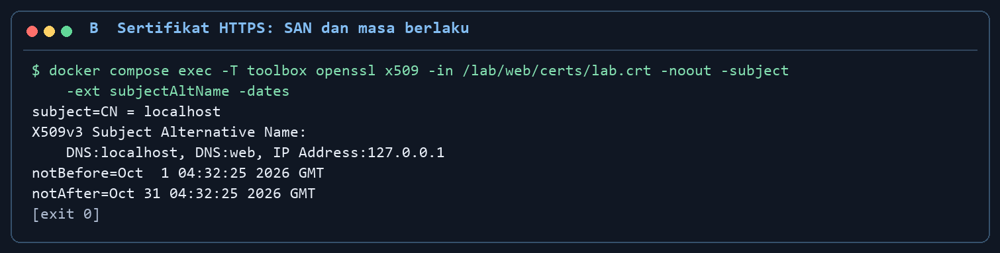
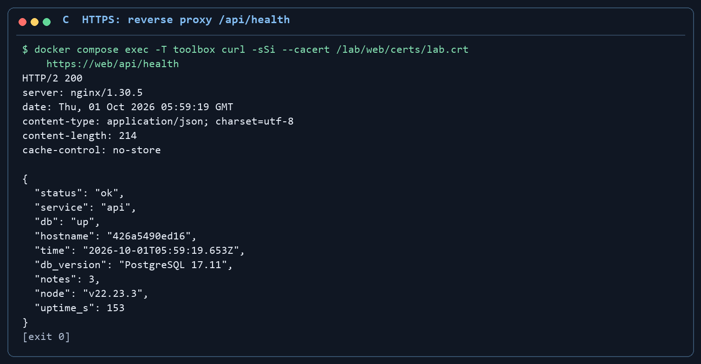
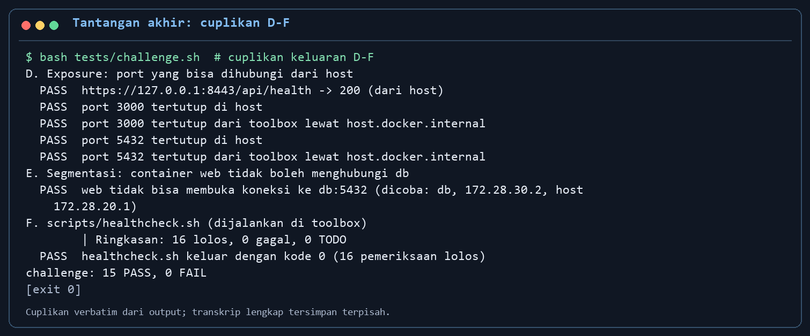
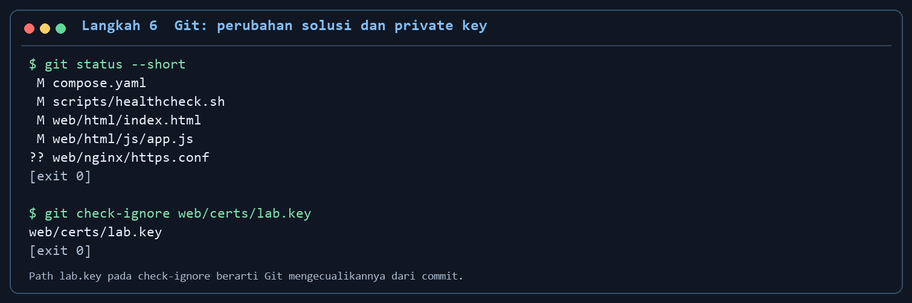
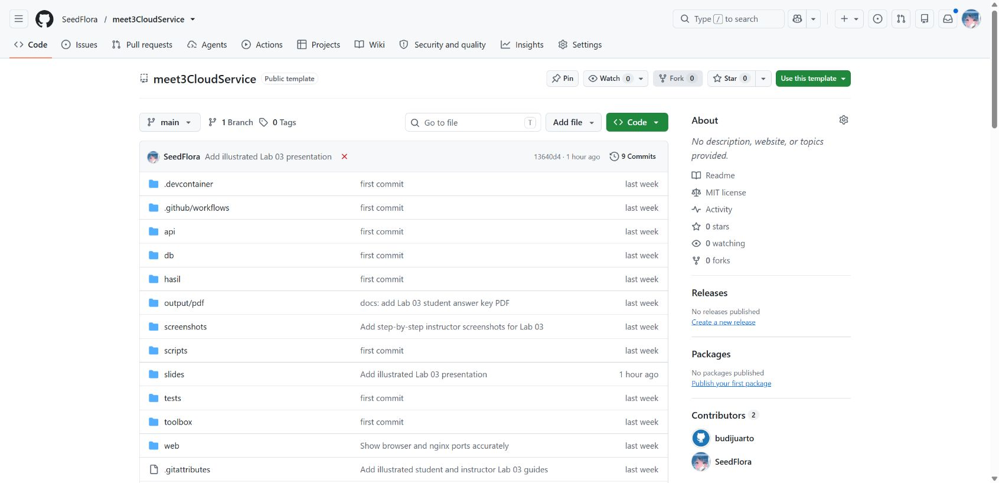
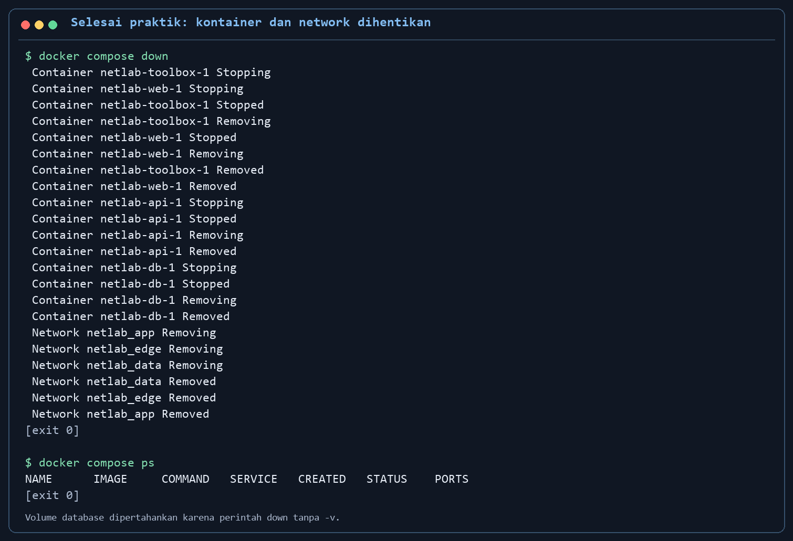

# Modul mahasiswa — Lab 03: DNS, HTTP, TLS, dan segmentasi jaringan

**Cara membaca bukti visual.** Setiap langkah bernomor di bawah mempunyai gambar hasil atau tampilan yang perlu diperiksa. Foto Codespaces, browser, dan Docker Desktop adalah tangkapan layar langsung. Gambar terminal berlatar gelap adalah cuplikan keluaran perintah yang benar-benar dijalankan dan ditata ulang agar teks terbaca; jalankan command pada blok di atas gambar untuk menghasilkan bukti praktik Anda sendiri. Alamat IP, waktu, dan nomor catatan dapat berbeda.

**COMP6991031 · sesi 3.** Repo ini berisi nginx (`web`), API Node.js (`api`), PostgreSQL (`db`), serta `toolbox` dengan alat jaringan. Bacalah juga [README lab](README.md) dan [panduan Git](PANDUAN_GIT.md). Akses dan pemindaian dalam modul ini **hanya untuk service lab milik Anda**.

## Tujuan dan teori ringkas

Anda akan menelusuri satu request melalui DNS → IP/port/TCP → HTTP → reverse proxy nginx → API → database; membedakan jaringan `edge`, `app`, `data`; membaca status/header HTTP; memeriksa sertifikat TLS; dan mengurangi port yang terpapar dari host. Docker Compose menyiapkan target latihan, sedangkan detail container diperdalam pada Lab 04–06. `localhost` di laptop berarti laptop, tetapi `localhost` di `toolbox` berarti container toolbox.

## Prasyarat

- Docker Desktop/Engine dengan Compose plugin aktif dan ruang disk untuk image. Di Windows, jalankan skrip `bash` dari Git Bash atau WSL; `docker compose` harus tersambung ke Engine.
- Jalur utama kelas: GitHub Codespaces dari repo pribadi hasil template dosen. Folder `.devcontainer/` sudah berada di root repo. Jalur lokal memakai Docker Desktop/Engine.
- Hentikan server Lab 01 terlebih dahulu: starter ini memakai host port **3000**; ia juga memakai **8080** dan **5432**. Jika port bentrok, periksa service yang sedang aktif.
- `student.json` di root repo masih contoh. Isi nama, kelas, dan username GitHub tanpa NIM sebelum mengumpulkan.

## 1. Preflight dan hidupkan empat service

Dari root repo, gunakan terminal Codespaces atau Bash/Git Bash:

```bash
docker compose version
docker compose config -q
docker compose up -d --build --wait
docker compose ps
bash tests/smoke.sh
bash tests/test_student.sh
```

`test_student.sh` akan merah jika `student.json` masih contoh. Isi file tersebut lalu ulangi tes. Buka `http://localhost:8080`; pada Codespaces gunakan port 8080 di panel **Ports**. Gambar terminal lokal dan Codespaces di bawah menunjukkan hasil acuan; alamat container dan waktu pada layar Anda akan berbeda.

**Checkpoint 1:** `web`, `api`, `db` sehat; `toolbox` berjalan; `smoke.sh` berakhir **12 PASS, 0 FAIL** pada paket yang diuji. Halaman menggambar alur browser → web → api → db. Catat kolom `PORTS` dari `docker compose ps`.


*Perintah: `docker compose ps`. Compose membaca keadaan container, healthcheck, dan port yang dipublish. Baca `STATUS`: web/API/DB harus healthy, toolbox running. Baca `PORTS`: starter memetakan web 8080, API 3000, DB 5432 ke host. Kolom gambar diringkas; jalankan perintah sendiri untuk detail lengkap.*

Contoh berikut diambil **langsung dari GitHub Codespaces** saat empat service Lab 03 berjalan. Terminal memperlihatkan `docker compose ps` dan smoke **12 PASS, 0 FAIL**; web port 8080 menampilkan alur browser -> web -> API -> DB. Label `443 -> 80` pada diagram adalah port forwarding Codespaces (HTTPS di sisi browser menuju HTTP nginx). Tantangan TLS baru selesai setelah `web:443` aktif dan `curl --cacert` berhasil.


*Perintah live: `docker compose ps --format '{{.Service}} {{.State}} {{.Health}}' && bash tests/smoke.sh | tail -n 4`. Compose menanyakan keadaan empat service; `&&` menjalankan smoke hanya jika perintah pertama berhasil. Smoke menguji DNS, HTTP, POST/GET catatan, dan akses host; `tail -n 4` hanya menampilkan empat baris akhirnya. Baca `smoke: 12 PASS, 0 FAIL`; jalankan `bash tests/smoke.sh` tanpa `tail` untuk melihat seluruh pemeriksaan.*


*Langkah UI: di panel **Ports**, buka port 8080. Browser mengirim GET ke nginx; frontend meminta `/api/health`, nginx meneruskan ke API, dan API mengecek PostgreSQL. Baca empat status hijau dan label `443 -> 80`: HTTPS berasal dari URL forwarding Codespaces, sedangkan nginx starter masih HTTP. Untuk bukti TLS nginx pada checkpoint 5, uji `https://web` dari toolbox.*

## 2. Periksa DNS dan konektivitas dari toolbox

Masuk ke toolbox:

```bash
docker compose exec toolbox bash
dig web A
nslookup api
getent hosts db
ping -c 3 web
traceroute -m 5 web
```

**Checkpoint 2:** nama service menghasilkan IP internal Docker (umumnya `172.28.x.x`). Amati bahwa `web` dan `api` dapat memiliki lebih dari satu alamat karena terhubung ke beberapa jaringan. Jika ICMP dibatasi lingkungan, catat pembatasannya dan lanjutkan pemeriksaan TCP/HTTP.


*Perintah: `dig web A`, `nslookup api`, `getent hosts db`, dan `ping -c 3 web` dari toolbox. Tiga perintah pertama meminta alamat internal dari DNS Compose; ping mengirim ICMP untuk memeriksa jalur ke web. Baca alamat `172.28.x.x` dan balasan/loss ping; IP bisa berubah saat stack dibuat ulang.*


*Perintah live di gambar memakai `docker compose exec -T toolbox bash -lc '...'` untuk menjalankan beberapa perintah sekaligus di toolbox; `-T` mematikan terminal interaktif, `bash -lc` menjalankan string perintah, `;` memisahkan perintah, dan `| tail -n` meringkas bagian output. Di dalamnya `dig +short web` dan `nslookup api` meminta IP internal, `ping -c 1 web` menguji ICMP, serta `traceroute -m 3 web` melihat hop. Baca IP web/API, `0% packet loss`, dan hop menuju web. Untuk mencoba satu per satu, masuk dengan `docker compose exec toolbox bash` seperti blok perintah di atas.*

## 3. Baca request dan status HTTP

Masih **di dalam toolbox**:

```bash
curl -i http://web/
curl -i http://web/api/health
curl -i http://web/api/whoami
curl -i http://web/api/notes/999999999
curl -i -X POST http://web/api/notes -H 'Content-Type: application/json' -d '{"text":"catatan lab 03"}'
wget -qO- http://web/api/health
```

**Checkpoint 3:** halaman dan health memberi 200, catatan tidak ada memberi 404, dan POST valid memberi 201 serta header `Location`. Bandingkan body keluaran `wget` dengan header+body dari `curl -i`.


*Perintah: `curl -i http://web/api/health` dan `curl -i http://web/api/notes/999999999`. `-i` menampilkan header serta body dari respons nginx -> API. Baca baris pertama: health `200` dengan JSON `db: up`; ID yang tidak ada `404`. Jalankan POST di atas untuk membuktikan `201` dan header `Location`.*

Keluar dari toolbox dengan `exit`, lalu dari host jalankan `curl http://localhost:8080/api/whoami` dan `curl http://localhost:3000/api/whoami`. Di PowerShell gunakan `curl.exe`:

```powershell
curl.exe -i http://localhost:8080/api/whoami
curl.exe -i http://localhost:3000/api/whoami
```

Bandingkan field `viaProxy` dan header penerusan dari nginx. Port host 3000 yang dapat diakses langsung adalah temuan awal, bukan keadaan akhir yang diinginkan.

## 4. Periksa port dan tantangan awal

Masuk lagi ke toolbox (`docker compose exec toolbox bash`) dan pindai **target lokal lab**:

```bash
nmap -sT -Pn -p 80,3000,5432 web
nmap -sT -Pn -p 3000 api
nmap -sT -Pn -p 8080,3000,5432 host.docker.internal
nc -vz -w 2 web 80
nc -vz -w 2 api 3000
nc -vz -w 2 host.docker.internal 5432
exit
bash tests/challenge.sh
```

**Checkpoint 4:** pada starter, `challenge.sh` **sengaja gagal**. Uji paket menunjukkan **1 PASS, 11 FAIL**: API/DB masih mem-publish port, HTTPS belum aktif, dan `healthcheck.sh` masih TODO. Angka IP dan durasi bisa berbeda.


*Perintah: `nmap -sT -Pn -p 8080,3000,5432 host.docker.internal`. `-sT` mencoba koneksi TCP dari toolbox ke port host Docker; `-Pn` tidak mengandalkan ping. Baca `open` untuk 8080/3000/5432 pada starter dan cocokkan dengan `docker compose ps`. Pindai hanya stack milik Anda.*


*Perintah live di gambar dibungkus `docker compose exec -T toolbox bash -lc '...'`; `;` menjalankan alat berurutan dan `| tail -n` membatasi baris nmap yang ditampilkan. `curl` mengambil kode health, `wget -qO-` membaca JSON, `nmap -sT -Pn` mencoba koneksi ke port host, `nc -vz api 3000` mencoba satu socket TCP, dan `openssl version` memeriksa alat TLS. Baca `HTTP 200`, `db: up`, tiga port `open`, serta `succeeded` untuk koneksi API. Jalankan perintah satu per satu dari toolbox agar output lengkap terlihat.*

Gambar berikut berasal dari materi sumber dan menunjukkan kegagalan awal yang memang perlu diselesaikan mahasiswa.


*Perintah: `bash tests/challenge.sh`. Skrip menguji publikasi port, sertifikat, HTTPS, segmentasi, dan healthcheck. Baca baris `FAIL` dan petunjuknya sebagai daftar pekerjaan; pada starter kegagalan ini memang diharapkan. Setelah perbaikan, jalankan lagi dan pastikan semua pemeriksaan lolos.*

## 5. Aktifkan TLS dan selesaikan tantangan

Di root repo, buat sertifikat lab **lebih dahulu**, lalu aktifkan konfigurasi nginx:

```bash
bash scripts/make-cert.sh
cp web/nginx/https.conf.example web/nginx/https.conf
```

Edit `compose.yaml`: hanya `web` yang boleh mem-publish port host, dan `web` perlu mapping host **8443** ke container **443**. Pertahankan komunikasi `web`↔`api` pada jaringan `app` dan `api`↔`db` pada jaringan `data`. Edit `scripts/healthcheck.sh`: lengkapi lima fungsi `check_dns`, `check_tcp`, `check_http`, `check_tls`, dan `check_exposure` sesuai TODO di file. Jangan salin kunci privat ke laporan/repo.

Terapkan perubahan dan uji:

```bash
docker compose up -d --force-recreate --wait
docker compose exec toolbox curl --cacert /lab/web/certs/lab.crt https://web/api/health
docker compose exec toolbox openssl x509 -in /lab/web/certs/lab.crt -noout -subject -issuer -dates -ext subjectAltName
docker compose exec toolbox bash scripts/healthcheck.sh
bash tests/smoke.sh
bash tests/challenge.sh
docker compose ps
```

**Checkpoint 5:** HTTPS menjawab 200 dengan `--cacert`; sertifikat memuat nama `web` dan masih berlaku; smoke tetap hijau; challenge menjadi hijau (pada penyelesaian paket uji **15 PASS, 0 FAIL**); healthcheck keluar 0 dengan minimal 10 pemeriksaan lolos. Port host 3000/5432 tidak lagi dipublish. Sertifikat ini **self-signed**, sehingga browser biasa dapat memberi peringatan kepercayaan.


*Perintah setelah mengaktifkan TLS: `docker compose up -d --force-recreate --wait`, lalu `docker compose exec toolbox curl --cacert /lab/web/certs/lab.crt https://web/api/health`. `--cacert` memverifikasi sertifikat self-signed lab dan koneksi nginx port 443; respons harus `200`. Saat membuka `https://localhost:8443` secara lokal, baca label 8443 -> 443, badge HTTPS, dan empat tier hijau. Browser dapat memperingatkan sertifikat self-signed.*


*Langkah UI: isi **Tulis catatan**, lalu klik **Simpan catatan**. Browser mengirim POST `/api/notes` melalui nginx ke API; API menulis ke PostgreSQL. Baca pesan `201 Created` dan catatan baru di daftar. Ini membuktikan jalur tulis frontend -> backend -> database tetap bekerja setelah TLS/segmentasi.*


*Perintah pada gambar: `docker compose ps --format 'table {{.Service}}\t{{.Status}}\t{{.Ports}}'` setelah perubahan Compose diterapkan. Docker menampilkan port host hanya pada `web`: 8080 -> 80 dan 8443 -> 443. `api` dan `db` masih healthy pada port internal 3000/5432 tetapi tidak lagi punya mapping host. Buktikan bersama `bash tests/smoke.sh` dan `bash tests/challenge.sh` milik Anda.*



*Perintah: `docker compose exec toolbox openssl x509 -in /lab/web/certs/lab.crt -noout -subject -issuer -dates -ext subjectAltName`. OpenSSL membaca sertifikat tanpa membuka private key. Baca `DNS:web` pada Subject Alternative Name serta tanggal `notBefore`/`notAfter`; nama host dan tanggal ini menentukan apakah verifikasi TLS dapat lulus.*



*Perintah: `docker compose exec toolbox curl --cacert /lab/web/certs/lab.crt https://web/api/health`. `--cacert` mempercayai CA/sertifikat lab khusus untuk request ini dan tetap memeriksa nama `web`. Baca HTTP 200 dan status database `up`; ini berbeda dari HTTPS forwarding Codespaces pada starter.*



*Perintah: `bash tests/challenge.sh` setelah perbaikan. Checker memverifikasi konfigurasi Compose, sertifikat, HTTPS, exposure host, segmentasi, dan healthcheck. Baca ringkasan `15 PASS, 0 FAIL`. Gambar adalah cuplikan keluaran aktual yang ditata ulang; simpan output lengkap dari praktik Anda sendiri.*

## Pertanyaan yang dijawab di laporan

1. Uraikan jalur request dari browser ke `db`, beserta nama jaringan dan port pada tiap langkah.
2. Apa beda `web`, `api`, dan `localhost` sebagai nama target ketika perintah dijalankan di host dan di toolbox?
3. Mengapa akses langsung ke `localhost:3000` dan akses melalui `localhost:8080` memberi informasi proxy yang berbeda?
4. Apa arti status HTTP 200, 201, 404, dan 400 yang dapat diamati di lab ini?
5. Mengapa `web` tidak perlu berbagi jaringan langsung dengan `db`? Apakah menghapus `ports:` dari `db` memutus koneksi `api` ke `db`?
6. Mengapa `curl --cacert` dapat memverifikasi sertifikat self-signed lab, sedangkan browser mungkin memperingatkan pengguna?

## Bukti, commit, dan push

Salin [`hasil/TEMPLATE_LAPORAN.md`](hasil/TEMPLATE_LAPORAN.md) menjadi `hasil/lab03.md` dari root repo. Simpan screenshot **milik Anda** di `hasil/bukti/lab03/` untuk `docker compose ps` sebelum/sesudah, `smoke.sh`, `challenge.sh` sebelum/sesudah, informasi sertifikat, dan ringkasan healthcheck. Gambar contoh modul bukan bukti pribadi.

Dari root repo:

```bash
git status --short
git add -A
git diff --cached --name-only
git diff --cached --check
git diff --cached
git check-ignore -v web/certs/lab.key
git commit -m "lab03: jaringan, HTTPS, dan segmentasi"
git push
```

Periksa staged diff **secara lokal**: `web/certs/lab.key`, `.env`, token, password nyata, NIM, dan screenshot kredensial tidak boleh masuk. Kunci dan sertifikat yang dibuat skrip masuk `.gitignore`; `web/nginx/https.conf` serta konfigurasi/tugas Anda boleh di-commit. Jika push pertama perlu upstream, gunakan `git push -u origin main` bila branch `main`. Workflow `.github/workflows/ci.yml` berada di root repo ini dan akan berjalan setelah push. Job `student` merah sampai `student.json` diisi; job `challenge` sengaja merah sampai perbaikan selesai.



*Perintah: `git status --short` dan `git check-ignore web/certs/lab.key`, kemudian `git diff --cached --name-only` setelah `git add`. `status` memperlihatkan file yang berubah, `check-ignore` membuktikan private key tidak ikut commit, dan daftar staged harus berisi hanya pekerjaan kelas yang aman dibagikan. Gambar adalah cuplikan output aktual yang ditata ulang.*



*Langkah UI setelah `git push`: buka repo milik Anda di GitHub, periksa branch `main`, pesan commit terbaru, dan berkas modul/kode yang muncul. Gambar menunjukkan repo template dosen, sehingga nama repo dan pesan commit mahasiswa akan berbeda. Tanda merah pada commit template berasal dari challenge starter yang memang belum dikerjakan; setelah solusi Anda di-push, buka tab **Actions** untuk menilai run milik Anda.*

## Berhenti dan mengatasi masalah

```bash
docker compose down
```



*Perintah: `docker compose down` lalu `docker compose ps`. Docker menghentikan dan menghapus container serta network lab; daftar `ps` menjadi kosong. Karena tidak memakai `-v`, volume database tetap ada untuk praktik berikutnya. Gambar adalah cuplikan keluaran perintah aktual yang ditata ulang.*

Perintah ini mempertahankan volume database; `docker compose down -v` menghapus data latihan bila Anda memang ingin reset. Jika `api`/`db` belum sehat, lihat `docker compose logs api db`. Jika nginx gagal setelah `https.conf` dibuat, pastikan sertifikat sudah dibuat dan lihat `docker compose logs web`. Setelah mengubah jaringan, gunakan `--force-recreate`. Jika port bentrok, hentikan Lab 01 atau service lokal lain. Jika `dig`, `nmap`, atau `openssl` tidak ada di host, jalankan perintahnya **di toolbox**.
