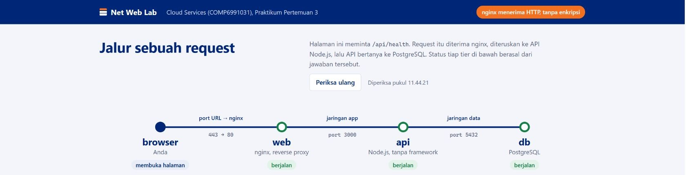
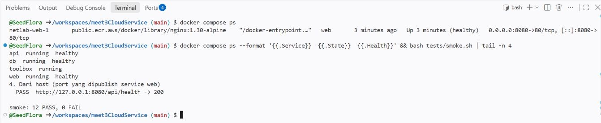
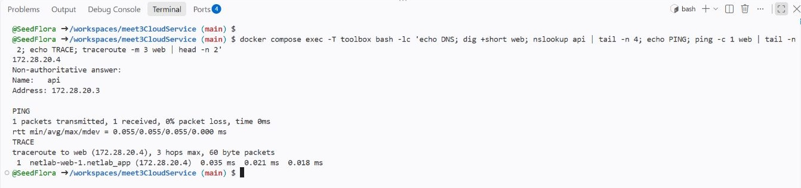
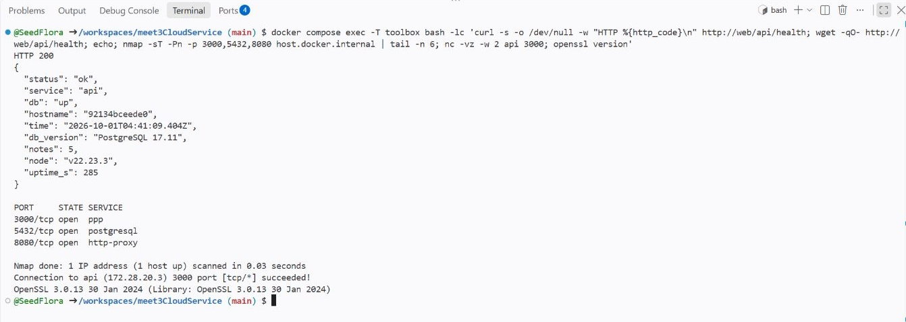
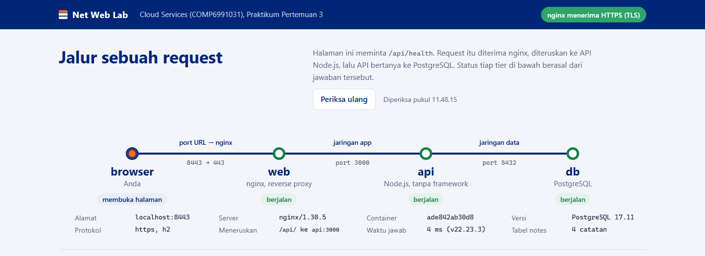
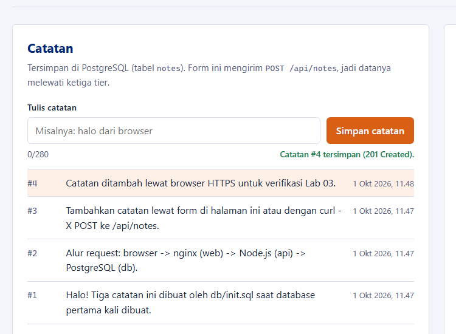

# Panduan dosen - Lab 03 Networking & Web Services

**COMP6991031 | Pertemuan 3 | 120 menit**
Repo kelas: [SeedFlora/meet3CloudService](https://github.com/SeedFlora/meet3CloudService) (**Public template**). Materi pendamping: [modul mahasiswa](MODUL_MAHASISWA.md), [panduan Git](PANDUAN_GIT.md), dan [template laporan](hasil/TEMPLATE_LAPORAN.md).

## Hasil belajar dan batas latihan

Mahasiswa menelusuri request browser -> nginx (`web`) -> Node API (`api`) -> PostgreSQL (`db`) dalam aplikasi empat container; memakai `dig`, `nslookup`, `ping`, `traceroute`, `curl`, `wget`, `nmap`, `nc`, dan `openssl`; mengidentifikasi port yang terpapar; lalu mengaktifkan HTTPS dan membatasi publikasi port tanpa merusak komunikasi antartier. Pemindaian hanya untuk **service lab milik mahasiswa sendiri**.

Lab ini pengantar desain multi-tier. Docker Compose dipakai sebagai lingkungan konsisten, sedangkan detail container dibahas di Lab 04-06. Pekerjaan kode mahasiswa berada di `compose.yaml`, `web/nginx/https.conf`, dan lima fungsi TODO pada `scripts/healthcheck.sh`. Mereka tidak perlu membuat frontend/backend baru.



*Langkah UI demo: buka port 8080 dari panel **Ports** Codespaces. Browser meminta halaman ke nginx; JavaScript meminta `/api/health`, nginx meneruskan ke API, lalu API mengecek PostgreSQL. Tunjuk empat status hijau. Label `443 -> 80` adalah forwarding HTTPS browser ke HTTP nginx starter, belum TLS nginx.*

## Persiapan dosen

1. Pastikan repo kelas menampilkan **Public template** dan tombol **Use this template**. Minta mahasiswa membuat repo pribadi dari template, lalu membuat Codespace dari repo masing-masing. Jalur cadangan: Docker Desktop/Engine lokal, Compose plugin, dan Git Bash/WSL di Windows.
2. Pastikan root repo mahasiswa memuat `.devcontainer/`, `.github/workflows/`, `compose.yaml`, `MODUL_MAHASISWA.md`, dan `screenshots/`. Tunggu `postCreateCommand` Codespaces selesai. Jika pull image terputus, ulangi `docker compose up -d --build --wait`.
3. Cek Docker dan port host 8080, 3000, 5432. Bila port bentrok, hentikan service lokal yang memakainya. Siapkan repo demo terpisah tanpa data pribadi.
4. Tampilkan panel **Ports** Codespaces. Gunakan visibilitas **Private** untuk port praktik. Port 8443 memakai sertifikat self-signed, sehingga browser mungkin memberi peringatan.

Terangkan status Actions awal: `stack` dirancang hijau; `student` merah selama `student.json` masih contoh; `challenge` **sengaja merah** sebelum tugas selesai.

## Rencana kelas 120 menit

| Waktu | Kegiatan | Bukti mahasiswa |
|---|---|---|
| 0-10 menit | Uraikan browser -> web -> API -> DB; buat repo pribadi dan Codespace/clone lokal. | URL repo dan terminal di root. |
| 10-25 menit | Preflight, hidupkan stack, buka web, jalankan smoke. | `docker compose ps`, port 8080, `smoke.sh`. |
| 25-45 menit | DNS dan konektivitas dari toolbox; bahas `localhost` host vs container. | `dig`, `nslookup`, `ping`/`traceroute`. |
| 45-65 menit | HTTP 200/201/404/400, header proxy, dan `wget`. | Output `curl -i`, perbandingan `viaProxy`. |
| 65-80 menit | Pindai hanya stack sendiri; jalankan challenge awal. | `nmap`/`nc`, port host awal, challenge merah. |
| 80-105 menit | Sertifikat, HTTPS, segmentasi, dan fungsi healthcheck. | TLS, port akhir, `healthcheck.sh`. |
| 105-120 menit | Uji ulang, laporan, cek staged diff, commit/push, lihat Actions. | Repo/commit, screenshot pribadi, CI. |

Jika sesi 90 menit, kerjakan checkpoint 1-4 di kelas dan lanjutkan checkpoint 5 beserta laporan sebagai tugas. Tetap kumpulkan bukti port **sebelum dan sesudah** perubahan.

## Demo dan checkpoint

### 1. Stack awal dan alur request

Dari root repo demo:

```bash
docker compose version
docker compose config -q
docker compose up -d --build --wait
docker compose ps
bash tests/smoke.sh
```

Tunjukkan `web`, `api`, `db` sehat serta `toolbox` berjalan. Pada paket uji lokal, smoke awal memberi **12 PASS, 0 FAIL**. Buka port 8080 pada panel **Ports** Codespaces atau `http://localhost:8080` secara lokal. Kolom `PORTS` starter memperlihatkan web, API, dan DB mem-publish port host.


*Perintah: `docker compose ps`. Compose meminta status runtime dan port publish dari Docker Engine. Tunjuk `healthy` pada web/API/DB, `running` pada toolbox, serta mapping host 8080/3000/5432 pada starter. Minta mahasiswa membandingkan output mereka, bukan menyalin gambar.*

Gambar berikut adalah hasil **uji live di GitHub Codespaces**: empat service berjalan dan smoke **12 PASS, 0 FAIL**. Halaman web di pembuka menampilkan empat tier aktif. Pakai ini untuk menunjukkan bahwa jalur Codespaces sungguh dapat menjalankan stack. Tautan browser Codespaces dapat memakai HTTPS karena port forwarding GitHub; itu **belum membuktikan** nginx starter telah mengaktifkan TLS. Bukti tantangan adalah `https://web` dari toolbox dengan `--cacert` dan sertifikat yang diperiksa OpenSSL.



*Perintah live: `docker compose ps --format '{{.Service}} {{.State}} {{.Health}}' && bash tests/smoke.sh | tail -n 4`. Compose merangkum empat container; `&&` menjalankan smoke hanya setelah Compose berhasil. Smoke meminta DNS, halaman, API, POST/GET DB, dan akses host; `tail -n 4` menyisakan empat baris terakhir. Tunjuk `smoke: 12 PASS, 0 FAIL`; minta mahasiswa menjalankan smoke tanpa `tail` untuk bukti lengkap.*

### 2. DNS dan konektivitas internal

```bash
docker compose exec toolbox bash
dig web A
nslookup api
getent hosts db
ping -c 3 web
traceroute -m 5 web
```

Minta mahasiswa menyebut **nama service, IP internal, jaringan, dan posisi terminal**. `web` dan `api` dapat punya lebih dari satu IP karena terhubung ke beberapa jaringan. `localhost` di toolbox menunjuk toolbox, bukan laptop. Jika ICMP dibatasi, gunakan TCP/HTTP sebagai pembuktian tambahan dan catat batasannya.


*Perintah: `dig web A`, `nslookup api`, dan `ping -c 3 web` dari toolbox. DNS Compose mengubah nama service menjadi IP internal; ping menguji ICMP. Tunjuk alamat `172.28.x.x` dan jumlah paket diterima/loss.*



*Perintah live di gambar: `docker compose exec -T toolbox bash -lc '...'`. `-T` mematikan terminal interaktif, `bash -lc` menjalankan beberapa perintah di toolbox, `;` memisahkan perintah, dan `| tail -n` merangkum output. Di dalamnya `dig +short web`/`nslookup api` meminta IP internal, `ping -c 1 web` menguji ICMP, dan `traceroute -m 3 web` melihat hop. Tunjuk IP web/API, `0% packet loss`, dan hop menuju web; mahasiswa dapat mencoba perintah satu per satu di shell toolbox.*

### 3. HTTP dan reverse proxy

Masih di toolbox:

```bash
curl -i http://web/api/health
curl -i http://web/api/whoami
curl -i http://web/api/notes/999999999
curl -i -X POST http://web/api/notes -H 'Content-Type: application/json' -d '{"text":"catatan kelas"}'
wget -qO- http://web/api/health
```

Tunjukkan status dan header sebelum body JSON. Health memberi 200 dan `db: up`; catatan yang tidak ada 404; POST valid 201 dengan `Location`. Untuk 400, kirim JSON rusak atau lihat smoke test. Bandingkan `curl -i` (header dan body) dengan `wget -qO-` (body). Dari host, bandingkan request ke 8080 melalui nginx dengan 3000 langsung ke API dan field `viaProxy`.

Pada uji browser **Codespaces live**, form frontend berhasil menyimpan catatan baru dan menampilkan `201 Created`; daftar serta hitungan catatan PostgreSQL bertambah. Gunakan observasi ini untuk menunjukkan POST browser -> nginx -> API -> DB. Screenshot area bawah web tidak disertakan karena memuat alamat IP klien.


*Perintah: `curl -i http://web/api/health` dan `curl -i http://web/api/notes/999999999`. Curl menampilkan status/header/body dari nginx dan API. Tunjuk `200` dengan `db: up` serta `404` untuk ID tak ada; hubungkan POST valid ke `201` dan `Location`.*

### 4. Port dan challenge awal

```bash
nmap -sT -Pn -p 8080,3000,5432 host.docker.internal
nc -vz -w 2 host.docker.internal 5432
exit
bash tests/challenge.sh
```

Challenge starter sengaja gagal. Contoh paket uji awal menunjukkan **1 PASS, 11 FAIL**; jumlah bisa berbeda menurut kondisi mesin. Bahas beda port yang dipublish ke host dengan koneksi internal jaringan `app`/`data`.


*Perintah: `nmap -sT -Pn -p 8080,3000,5432 host.docker.internal`. Toolbox mencoba koneksi TCP ke host Docker. Tunjuk tiga status `open` dan cocokkan dengan mapping pada `docker compose ps`; target pemindaian hanya lab sendiri.*



*Perintah live dibungkus `docker compose exec -T toolbox bash -lc '...'`; `;` menjalankan alat berurutan dan `| tail -n` membatasi output nmap yang tampak. `curl` mengambil status health, `wget -qO-` mengambil JSON, `nmap` mencoba port host, `nc -vz api 3000` menguji satu socket, dan `openssl version` memeriksa alat TLS. Tunjuk `HTTP 200`, `db: up`, port 3000/5432/8080 `open`, dan koneksi API `succeeded` sebagai dasar perubahan desain.*


*Perintah: `bash tests/challenge.sh`. Skrip membandingkan desain Compose, sertifikat, HTTPS, exposure, segmentasi, dan healthcheck dengan sasaran lab. Tunjuk `FAIL` beserta hint sebagai diagnosis awal; bukan error platform. Jalankan ulang setelah tugas untuk membuktikan semua lulus.*

### 5. TLS dan perubahan desain

Minta mahasiswa membuat sertifikat dengan `bash scripts/make-cert.sh`, menyalin `web/nginx/https.conf.example` ke `web/nginx/https.conf`, dan mengubah `compose.yaml` agar hanya `web` mem-publish port host 8080/8443. `web` <-> `api` tetap di jaringan `app`; `api` <-> `db` tetap di `data`. `web` tidak perlu berbagi jaringan langsung dengan `db`. Mahasiswa melengkapi `check_dns`, `check_tcp`, `check_http`, `check_tls`, dan `check_exposure` di `scripts/healthcheck.sh`; komentar TODO adalah petunjuk. Jangan bagikan file solusi penuh.

```bash
docker compose up -d --force-recreate --wait
docker compose exec toolbox curl -i --cacert /lab/web/certs/lab.crt https://web/api/health
docker compose exec toolbox openssl x509 -in /lab/web/certs/lab.crt -noout -subject -issuer -dates -ext subjectAltName
docker compose exec toolbox bash scripts/healthcheck.sh
bash tests/smoke.sh
bash tests/challenge.sh
docker compose ps
```

Sasaran: HTTPS menjawab 200 dengan `--cacert`; sertifikat memuat SAN `web` dan masih berlaku; smoke hijau; healthcheck keluar 0 dengan minimal 10 pemeriksaan lolos; challenge hijau (contoh paket uji **15 PASS, 0 FAIL**). Hanya `web` mem-publish port host. API/DB tetap berjalan pada jaringan internal.

Hasil acuan dari uji end-to-end **lokal** pada paket ini: starter empat service berjalan, smoke **12/0**, challenge awal **1/11**; setelah penyelesaian sementara, smoke **12/0**, healthcheck **16/0**, challenge **15/0**, verifikasi OpenSSL **0 (ok), TLS 1.3**, dan hanya host 8080/8443 terbuka. Starter juga diuji **live di Codespaces SeedFlora** dengan empat service sehat dan smoke **12/0**. File solusi sementara tidak disertakan pada repo template. Akses dan kuota Codespaces setiap akun mahasiswa tetap perlu dicek.



*Perintah: `docker compose up -d --force-recreate --wait`, lalu `docker compose exec toolbox curl --cacert /lab/web/certs/lab.crt https://web/api/health`. Curl memverifikasi sertifikat lab serta koneksi nginx:443 dan harus memberi 200. Saat membuka `https://localhost:8443` lokal, tunjuk label 8443 -> 443, badge HTTPS, dan empat tier hijau; browser dapat memperingatkan sertifikat self-signed.*



*Langkah UI: isi form **Tulis catatan** dan klik **Simpan catatan**. Browser mengirim POST `/api/notes` melalui nginx ke API; API menulis ke PostgreSQL. Tunjuk `201 Created` dan catatan baru sebagai bukti jalur tulis tiga tier tetap berfungsi setelah TLS/segmentasi.*


*Perintah pada gambar: `docker compose ps --format 'table {{.Service}}\t{{.Status}}\t{{.Ports}}'` setelah Compose direcreate. Tunjuk `web` mem-publish 8080 -> 80 dan 8443 -> 443, sedangkan API/DB hanya port internal dan tetap healthy. Bandingkan dengan nmap awal serta `bash tests/smoke.sh` dan `bash tests/challenge.sh` akhir. Gambar target berasal dari salinan uji, bukan bukti mahasiswa.*

## Panduan dosen: menuntun `challenge.sh` sampai tuntas

Bagian ini adalah urutan mengajar dan mendiagnosis, bukan file jawaban untuk disalin mahasiswa. Jalankan `bash tests/challenge.sh` dari **root repo pada terminal host/Codespaces**, karena skrip memanggil Docker Compose. Jalankan `scripts/healthcheck.sh` **di toolbox**. Challenge membaca keadaan sistem; ia tidak memperbaiki file otomatis.

### 0. Ambil bukti sebelum perubahan

```bash
docker compose config -q
docker compose up -d --build --wait
docker compose ps
bash tests/smoke.sh
bash tests/challenge.sh
echo $?
```

`config -q` memeriksa YAML dan hasil interpolasi Compose tanpa output bila valid. `up --wait` menunggu healthcheck container. `smoke.sh` memastikan fungsi dasar tetap bekerja sebelum desain diubah (paket uji: 12 PASS). `challenge.sh` biasanya keluar bukan 0 pada starter; angka PASS/FAIL dapat berubah jika mahasiswa sudah membuat sertifikat atau ada port lain di komputer. Minta screenshot **output awal milik mahasiswa**, bukan angka tertentu. `echo $?` menampilkan exit code perintah terakhir di Bash: 0 berarti seluruh pemeriksaan challenge lulus.

Skrip memuat helper dari `tests/lib.sh`, lalu membagi pemeriksaan ke **A-F**. A membaca `docker compose config --format json`; B-F memerlukan stack hidup. Jika host belum memiliki `jq`, helper memakai `jq` di toolbox. Jangan menyimpulkan masalah desain dari pesan `compose.yaml tidak valid`: betulkan sintaks YAML terlebih dahulu.

### 1. Baca hasil A: desain Compose (3 PASS)

1. **Publisher host:** hanya `web` boleh punya bagian `ports:`. `api:3000` dan `db:5432` tetap bisa dihubungi lewat jaringan internal walaupun tidak dipublish ke host. `expose:` hanya dokumentasi port internal dan tidak menggantikan `ports:`.
2. **Port TLS:** `web` harus memetakan sebuah port host ke **port container 443**, contoh host 8443 ke container 443. HTTP 8080 ke 80 boleh tetap ada agar perbandingan awal/akhir terlihat.
3. **Segmentasi:** `web` dan `db` tidak boleh berbagi jaringan. Hubungan yang diperlukan adalah `web`- `api` di `app`, serta `api`- `db` di `data`; toolbox boleh bergabung ke ketiga jaringan sebagai alat uji. `data.internal: true` adalah bonus, bukan syarat 15 PASS.

Minta mahasiswa membaca baris `service yang mem-publish port ke host`, `web belum mem-publish port 443`, dan `web dan db sama-sama terhubung` satu per satu. Setelah edit `compose.yaml`, ulangi `docker compose config -q`. Nilai desain harus dibuktikan lagi pada runtime; menghapus `ports:` di file tanpa membuat ulang container dapat meninggalkan mapping lama.

### 2. Baca hasil B: sertifikat (3 PASS)

```bash
bash scripts/make-cert.sh
docker compose exec toolbox openssl x509 -in /lab/web/certs/lab.crt -noout -subject -issuer -dates -ext subjectAltName
```

Perintah pertama membuat sertifikat dan kunci lab. Perintah kedua membaca sertifikat tanpa membocorkan isi private key. Tunjuk tiga SAN wajib: `DNS:localhost`, `DNS:web`, dan `IP Address:127.0.0.1`. Challenge juga meminta sertifikat masih berlaku **minimal tujuh hari**. Jika file hilang, SAN kurang, atau masa berlaku pendek, buat ulang dengan `make-cert.sh`. `web/certs/lab.key` tetap lokal dan tidak masuk Git.

### 3. Baca hasil C: HTTPS nginx dari toolbox (2 PASS)

```bash
cp web/nginx/https.conf.example web/nginx/https.conf
docker compose up -d --force-recreate --wait
docker compose exec toolbox curl -i --cacert /lab/web/certs/lab.crt https://web/api/health
docker compose exec -T toolbox \
  openssl s_client -connect web:443 -servername web \
  -CAfile /lab/web/certs/lab.crt -verify_hostname web \
  </dev/null
```

Nginx memuat berkas berakhiran `.conf`; `.conf.example` sendiri belum mengaktifkan HTTPS. Buat sertifikat sebelum me-recreate `web`, karena konfigurasi TLS membutuhkannya. `curl --cacert` memvalidasi sertifikat self-signed lab dan mengirim GET melalui nginx ke API dan database; baca JSON `status: ok`, `db: up`, dan HTTP 200. OpenSSL harus menampilkan `Verify return code: 0 (ok)` untuk nama `web`. Jangan memakai `curl -k` sebagai bukti C: opsi itu melewati verifikasi sertifikat. HTTPS pada URL forwarding Codespaces juga belum membuktikan nginx port 443 aktif.

Jika status `000`/connection refused, cek `docker compose ps`, `docker compose logs web`, nama `https.conf`, dan sertifikat. Jika HTTPS menjawab **502/503/504**, periksa `docker compose logs api` dan kesehatan DB; sesudah perubahan jaringan gunakan `--force-recreate --wait`.

### 4. Baca hasil D: exposure host (5 PASS)

```bash
docker compose ps
curl -i -k https://127.0.0.1:8443/api/health
docker compose exec toolbox nmap -sT -Pn -p 8080,8443,3000,5432 host.docker.internal
```

Port host HTTPS yang sebenarnya mengikuti mapping Anda (contoh **8443**). `curl -k` di langkah ini hanya memeriksa endpoint host dengan sertifikat self-signed; validasi trust tetap memakai `--cacert` pada C. Target akhir: HTTPS host memberi 200, sedangkan 3000 dan 5432 **tertutup dari dua sudut**: `127.0.0.1` pada host dan `host.docker.internal` dari toolbox. Challenge menghitung satu PASS untuk host HTTPS dan empat PASS untuk dua port dari dua sudut itu. Jika satu port masih `open`, cocokkan `docker compose ps` dengan `ports:` dan cek aplikasi lain yang memakai port yang sama.

### 5. Baca hasil E: segmentasi yang benar (1 PASS)

Challenge mencoba membuka `db:5432` **dari container web** melalui nama `db`, setiap IP container DB, dan gateway host Docker. Ketiganya harus gagal. Pertanyaan penting untuk diskusi: walaupun DNS `db` tidak ter-resolve dari `web`, apakah DB yang masih dipublish pada host bisa dicapai melalui gateway? Pada desain awal, jalur host dapat melubangi segmentasi. Karena itu perubahan jaringan **dan** penghapusan publish DB harus diperiksa bersama. Toolbox tetap boleh menghubungi DB, karena toolbox sengaja berada di jaringan `data`.

### 6. Baca hasil F: lima fungsi healthcheck (1 PASS)

```bash
docker compose exec toolbox bash scripts/healthcheck.sh
echo $?
```

Mahasiswa melengkapi lima fungsi bertanda TODO di `scripts/healthcheck.sh`: DNS untuk tiga nama service, TCP untuk `web:80`, `web:443`, `api:3000`, `db:5432`, HTTP health melalui proxy, TLS beserta masa berlaku/hostname, dan exposure host. Fungsi `ok` menambah penghitung lolos, `bad` menambah gagal, `todo` menandai fungsi belum dikerjakan. Target challenge: exit code **0**, baris `Ringkasan: N lolos, 0 gagal, 0 TODO`, dan **N minimal 10** (penyelesaian paket uji: 16). Exit 0 dengan 9 lolos tetap gagal F. Jika ada `[TODO]` atau `[GAGAL]`, gunakan nama section untuk kembali ke fungsi yang tepat.

### 7. Uji regresi dan simpulkan 15 PASS

```bash
docker compose up -d --force-recreate --wait
docker compose exec toolbox bash scripts/healthcheck.sh
bash tests/smoke.sh
bash tests/challenge.sh
docker compose ps
```

Hitung hasil akhir menurut kelompok: **A 3 + B 3 + C 2 + D 5 + E 1 + F 1 = 15 PASS**. Smoke harus tetap hijau (paket uji: 12 PASS, 0 FAIL), karena menutup port host API/DB tidak boleh memutus jalur internal browser -> nginx -> API -> PostgreSQL. Pada `docker compose ps`, hanya `web` mempunyai mapping host 8080/8443; `api` dan `db` tetap healthy. Mahasiswa menyimpan screenshot **awal dan akhir**, menjelaskan perubahan yang menyebabkan tiap FAIL berubah menjadi PASS, lalu commit/push. Jika challenge masih merah, baca kelompok gagal; jangan mengulang semua perubahan secara acak.

## Penilaian

| Komponen | Bobot | Yang diperiksa |
|---|---:|---|
| Observasi awal | 20% | Screenshot hasil sendiri: Compose, smoke, DNS/HTTP, challenge dan port awal; penjelasan status tepat. |
| Jaringan dan TLS | 30% | Hanya web terpublikasi; API/DB sehat; HTTPS tervalidasi; tidak ada jalur web langsung ke DB. |
| Healthcheck dan uji ulang | 25% | Lima fungsi bekerja, minimal 10 lolos, smoke dan challenge akhir lulus. |
| Penjelasan konsep | 15% | Enam jawaban modul menjelaskan DNS, TCP, proxy, HTTP, segmentasi, dan trust sertifikat. |
| Pengumpulan | 10% | `student.json`, laporan, screenshot pribadi, commit/push, dan Actions dapat diperiksa; tanpa kunci privat. |

Nilai didasarkan pada hasil, bukan pilihan Codespaces atau Docker lokal. Jika kuota Codespaces terbatas, terima jalur lokal dengan bukti setara. Screenshot modul yang disalin bukan bukti praktik.

## Masalah umum

| Gejala | Pemeriksaan dan tindakan |
|---|---|
| Compose tidak tersambung | Periksa Docker Engine/Codespaces selesai start, lalu `docker info`. Di Windows gunakan Git Bash/WSL yang terhubung ke Engine. |
| `bind: address already in use` | Hentikan service lokal yang memakai 8080, 3000, atau 5432; ulangi Compose. |
| API/DB belum healthy | `docker compose ps -a` dan `docker compose logs api db`; setelah perubahan jaringan pakai `--force-recreate`. |
| nginx gagal setelah `https.conf` dibuat | Pastikan sertifikat dibuat dahulu; baca `docker compose logs web`. |
| Browser memperingatkan HTTPS | Sertifikat self-signed belum dipercaya browser; verifikasi lab dengan `curl --cacert` dari toolbox. |
| Alat jaringan tidak ada di host | Jalankan `dig`, `nmap`, dan `openssl` dari toolbox. |
| Actions merah | Buka nama job: `student` perlu identitas, `challenge` merah pada starter; jika `stack` merah, baca log build dan smoke. |

## Pengumpulan dan penutupan

Mahasiswa menyalin `hasil/TEMPLATE_LAPORAN.md` menjadi `hasil/lab03.md`, menyimpan screenshot **milik sendiri** di `hasil/bukti/lab03/`, mengisi `student.json` tanpa NIM, memeriksa `git diff --cached`, lalu commit/push. Minta tautan repo pribadi, commit akhir, dan run Actions. Konfigurasi serta laporan boleh masuk Git; `web/certs/lab.key`, `.env`, token, password nyata, dan screenshot kredensial tidak boleh masuk. Tutup dengan `docker compose down`; `down -v` hanya untuk reset data yang memang diinginkan.
