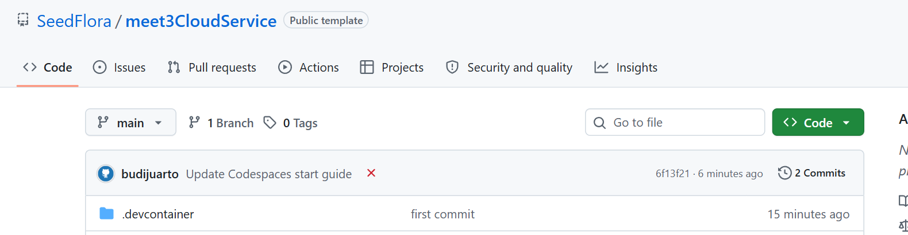

# Git untuk dokumentasi Lab 03

**Kebijakan kelas:** Lab ini latihan formatif, tanpa tugas, nilai, atau penyerahan terpisah. Satu proyek besar dikerjakan oleh kelompok **3 orang**, dengan presentasi checkpoint minggu 7 (UTS) dan hasil akhir minggu 14 (UAS). Simpan hasil lab hanya bila berguna sebagai referensi atau bukti proses proyek. Baca [brief proyek kelompok](PROYEK_KELOMPOK.md). Bobot resmi tetap mengikuti RPS/LMS.

Repo ini adalah satu lab mandiri. Jalankan semua perintah dari root, tempat `compose.yaml` berada.

## Mahasiswa: buat repo dan Codespace

1. Buka [SeedFlora/meet3CloudService](https://github.com/SeedFlora/meet3CloudService) setelah login GitHub. Pastikan ada label **Public template**, lalu pilih **Use this template → Create a new repository**. Buat repo milik sendiri; visibilitas sesuai arahan kelas.
2. Dari repo sendiri pilih **Code → Codespaces → Create codespace on main**. Di Codespace, folder kerja yang dibuka adalah root repo ini.
3. Isi `student.json` dengan nama, kelas, username GitHub. Jangan tulis NIM. Jalankan `bash tests/test_student.sh`.
4. Kerjakan [modul bergambar](MODUL_MAHASISWA.md), termasuk screenshot hasil sendiri di `hasil/bukti/lab03/` dan laporan `hasil/lab03.md`.



*Langkah UI pada gambar: buka repo kelas dan pastikan label **Public template** serta branch `main` terlihat. Setelah login, klik **Use this template → Create a new repository** untuk menyalin starter ke repo Anda; jangan bekerja langsung di repo kelas. Di repo pribadi klik **Code → Codespaces → Create codespace on main**. Saat editor terbuka, baca root file `compose.yaml` dan lanjutkan perintah pada modul mahasiswa.*

## Commit dan push

```bash
git status --short
git add -A
git diff --cached --name-only
git diff --cached --check
git diff --cached
git check-ignore -v web/certs/lab.key
git commit -m "lab03: hasil networking dan web services"
git push
```

Sebelum commit, periksa daftar file dan diff. Jangan ikutkan `web/certs/lab.key`, `.env`, token, password nyata, NIM, atau screenshot kredensial. File konfigurasi nginx, Compose, `healthcheck.sh`, laporan, dan bukti aman boleh dipush. Bila `git push` pertama meminta upstream, jalankan `git push -u origin main` pada branch `main`.

Di tab **Actions**, job `student` akan merah selama `student.json` masih contoh. Job `challenge` sengaja merah pada starter; hijau setelah konfigurasi dan healthcheck berhasil. Tautan repo/commit dan hasil Actions boleh disimpan sebagai bukti proses proyek kelompok; tidak ada penyerahan Lab 03 tersendiri.

Jika dosen hanya menggunakan jalur lokal tanpa pengumpulan Git, praktik Docker tetap dapat dijalankan dari folder ini tanpa push.
